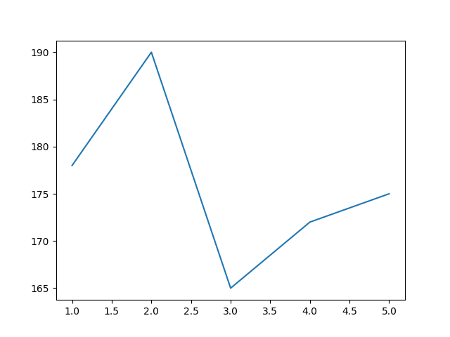
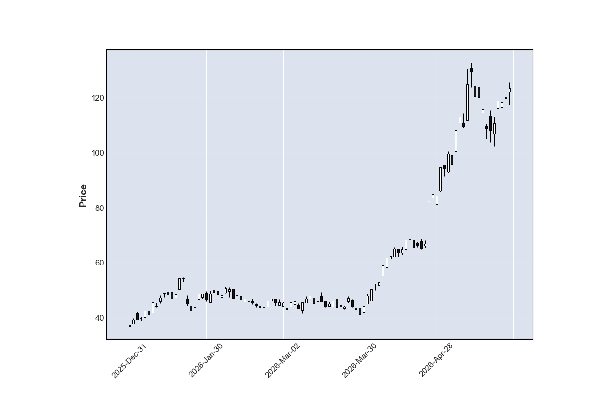
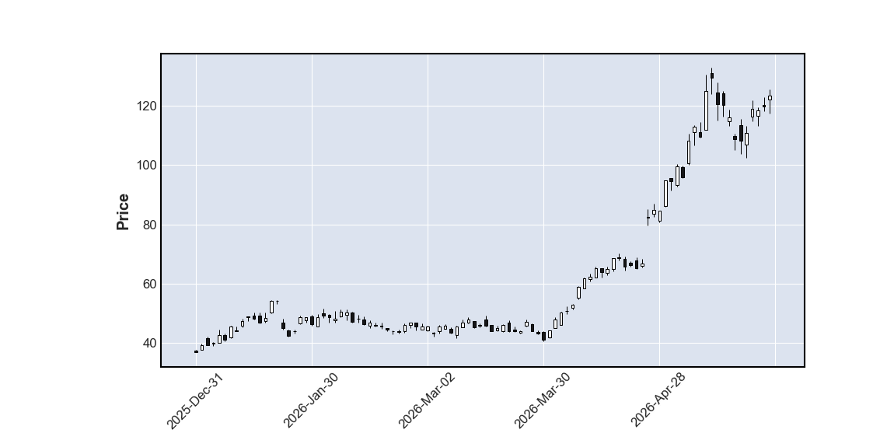
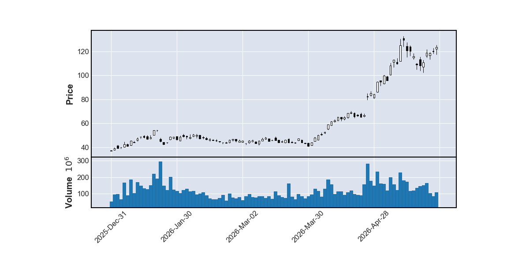
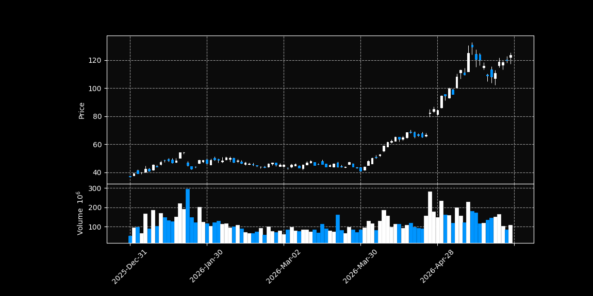
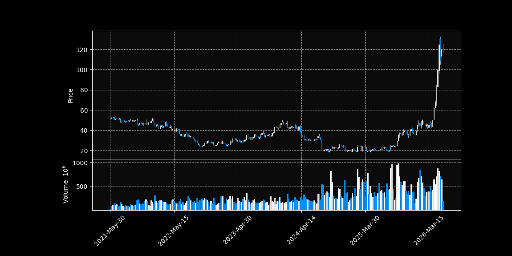
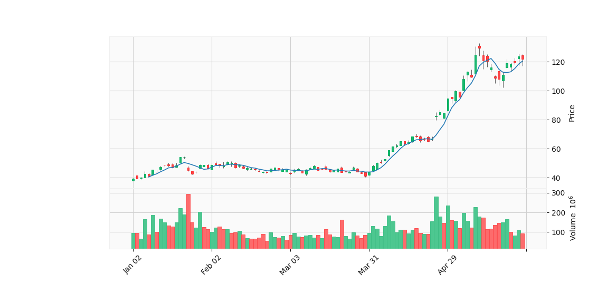
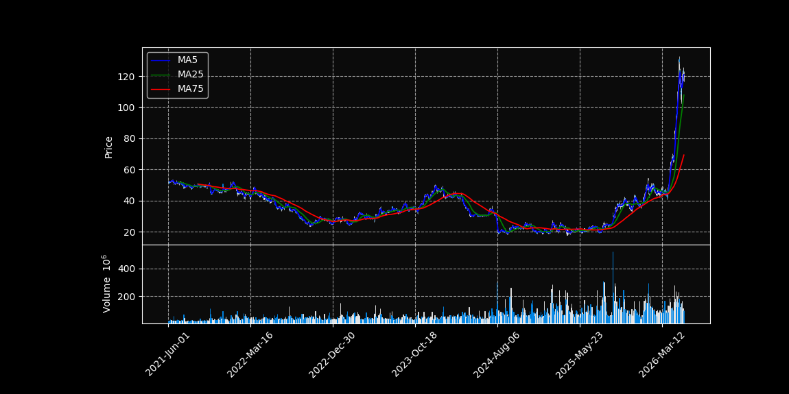

# Plotting Data Using Matplotlib

In this chapter, we will learn how to plot data using Python.  
Later, we will use this skill to plot stock price data downloaded from `yfinance`.

## Simple Matplotlib Example

`matplotlib` is a Python library used for making graphs and figures.  
The most commonly used part of this library is `matplotlib.pyplot`.

For example:

```python
import numpy as np
import matplotlib.pyplot as plt

values = np.array([1, 2, 3, 4, 5])
height = np.array([178, 190, 165, 172, 175])

plt.plot(values, height)

plt.show()
```

In this example, `values` is used for the x-axis, and `height` is used for the y-axis.

The command:

```python
plt.plot(values, height)
```

creates a line plot.

The command:

```python
plt.show()
```

displays the plot window.

So the basic structure is:

```python
plt.plot(x_data, y_data)
plt.show()
```



## Plotting Stock Data Using mplfinance

Next, we will use another Python library called **mplfinance**.

`mplfinance` is useful for plotting financial data.  
Using this library, we can easily create **candlestick charts** from stock price data.

It can also automatically add useful technical analysis lines, such as **moving averages**.

First, let's get stock price data.  
Since the semiconductor industry is currently important because of AI, let's download Intel stock data for the last five years using `yfinance`.

```python
import yfinance as yf

intel_df = yf.download("INTC", period="5y")

print(intel_df.head())
```

The result will look like this:

```text
Price           Close       High        Low       Open    Volume
Ticker           INTC       INTC       INTC       INTC      INTC
2021-05-27  52.829552  52.966820  52.161519  52.262182  32387600
2021-05-28  52.271332  52.756345  52.106611  52.664831  20303900
2021-06-01  52.060863  52.911920  51.786330  52.719747  20326400
2021-06-02  52.600777  52.792950  51.941893  52.079162  18483600
2021-06-03  51.466038  52.253033  51.328769  52.143220  21831300
```

In this output, the first two lines are both part of the column header.  
The first header level contains the price type, such as `Close`, `High`, `Low`, `Open`, and `Volume`.  
The second header level contains the ticker symbol, `INTC`.

However, `mplfinance` expects a simpler DataFrame with one header row and columns in the standard OHLCV order:

```text
Open, High, Low, Close, Volume
```

In the output above, the columns are displayed as:

```text
Close, High, Low, Open, Volume
```

So visually, the order is **CHLOV**.  
Therefore, we need to remove the second ticker header level and reorder the columns into **OHLCV** format.

```python
intel_df.columns = intel_df.columns.get_level_values(0)
intel_df = intel_df[["Open", "High", "Low", "Close", "Volume"]]

print("Cleaned data:")
print(intel_df.head())
```

The cleaned data will look like this:

```text
Cleaned data:
Price            Open       High        Low      Close    Volume
2021-05-27  52.262189  52.966828  52.161526  52.829559  32387600
2021-05-28  52.664839  52.756352  52.106619  52.271339  20303900
2021-06-01  52.719743  52.911916  51.786326  52.060860  20326400
2021-06-02  52.079166  52.792954  51.941897  52.600780  18483600
2021-06-03  52.143220  52.253033  51.328769  51.466038  21831300
```

Now we are ready to use `mplfinance`.

First, let's plot the most recent 100 days of Intel stock data.

```python
import mplfinance as mpf

current_data = intel_df.tail(100)

mpf.plot(current_data, type="candle")
```

This creates a basic candlestick chart using the most recent 100 trading days.



The chart type can be changed using the `type` option.  
For example, `mplfinance` supports chart types such as:

```text
candle
line
renko
pnf
```

We will discuss these chart types in more detail later.

In `mplfinance`, we can also change the shape of the figure using the `figratio` option.

```python
mpf.plot(current_data, type="candle", figratio=(2, 1))
```



The best figure ratio depends on the type of chart and the layout you want.

### Plotting the Volume

We can also plot the trading volume by setting the `volume` option to `True`.

```python
mpf.plot(current_data, type="candle", figratio=(2, 1), volume=True)
```



As you can see, the volume data is shown below the candlestick chart.

Volume shows how many shares were traded during each time period.  
When the volume becomes large, it means many people are buying and selling the stock.  
Sometimes, large volume appears near large stock price movements, so volume can help us understand how strongly the market reacted.

### Changing the style

We can also change the style of the chart using the `style` option.

For example, we can use the `"nightclouds"` style:

```python
mpf.plot(current_data, type="candle", figratio=(2, 1), volume=True, style = "nightclouds")
```



If the closing price is higher than the opening price, the candlestick is called a **bullish candlestick**.

If the closing price is lower than the opening price, the candlestick is called a **bearish candlestick**.

On April 24, 2026, Intel stock increased sharply because Intel reported much better Q1 earnings than expected. This is an example of how company news, especially earnings reports, can strongly affect stock prices.

### Showing Weekly Charts

So far, we have plotted candlestick charts using **daily stock data**.  
However, sometimes we may want to look at the stock price using a longer time scale, such as **weekly charts**.

To do this, we can use the pandas method called **`resample()`**.

The `resample()` method allows us to change the time period of the data.  
For example, we can resample daily data into weekly data, monthly data, hourly data, and so on.

Some common resampling symbols are:

| Symbol | Meaning |
|---|---|
| `D` | Daily |
| `W` | Weekly |
| `M` | Monthly |
| `H` | Hourly |
| `T` or `min` | Minute |

One important thing to note is that each OHLCV column needs a different method when resampling.

For weekly candlestick data:

| Column | Method | Reason |
|---|---|---|
| Open | `first()` | We want the first opening price of the week |
| High | `max()` | We want the highest price of the week |
| Low | `min()` | We want the lowest price of the week |
| Close | `last()` | We want the last closing price of the week |
| Volume | `sum()` | We want the total trading volume of the week |

To make again the OHLCV dataframe we can use the aggregate method. so for example

```python
intel_df = yf.download("INTC", period="5y")

intel_df.columns = intel_df.columns.get_level_values(0)
intel_df = intel_df[["Open", "High", "Low", "Close", "Volume"]]

resampled = intel_df.resample("W")

wdf = resampled.aggregate({
    "Open": "first",
    "High": "max",
    "Low": "min",
    "Close": "last",
    "Volume": "sum"
})

mpf.plot(wdf, type="candle", figratio=(2, 1), volume=True, style = "nightclouds")
```



### Plotting the Moving Average in the Chart

We can also add moving averages to the candlestick chart by using the `mav` option in `mpf.plot()`.

The moving average time frame can be chosen freely.  
Common examples are:

| Moving Average | Meaning |
|---|---|
| 5-day MA | Short-term trend |
| 25-day MA | Medium-term trend |
| 75-day MA | Longer-term trend |

For example, to plot a 5-day moving average, we can write:

```python
mpf.plot(
    current_data,
    type="candle",
    figratio=(2, 1),
    volume=True,
    style="yahoo",
    mav=5
)
```


We can also plot multiple moving averages at the same time:

```python
mpf.plot(
    current_data,
    type="candle",
    figratio=(2, 1),
    volume=True,
    style="yahoo",
    mav=(5, 25, 75)
)
```

In this case, the chart will show three moving average lines:

```text
5-day moving average
25-day moving average
75-day moving average
```

As you can see, the first few days do not have a moving average line.  
This is because the moving average is not defined until enough data points are available.

For example, a 5-day moving average needs at least 5 days of data.  
Therefore, the first 4 days do not have a 5-day moving average value.

We can also calculate moving averages manually by using the pandas `rolling()` method.

```python
df["ma5"] = df["Close"].rolling(window=5).mean()
```

Here, `rolling(window=5)` means that pandas takes the latest 5 data points, and `.mean()` calculates their average.

In `mplfinance`, if we want to add extra data to the chart, we can use the `make_addplot()` method.

For example:

```python
import yfinance as yf
import mplfinance as mpf

intel_df = yf.download("INTC",period="5y")

print(intel_df.head())

intel_df.columns = intel_df.columns.get_level_values(0)
intel_df = intel_df[["Open", "High", "Low", "Close", "Volume"]]

intel_df["ma5"] = intel_df["Close"].rolling(window=5).mean()
intel_df["ma25"] = intel_df["Close"].rolling(window=25).mean()
intel_df["ma75"] = intel_df["Close"].rolling(window=75).mean()

addp = [
    mpf.make_addplot(intel_df["ma5"], color="blue"),
    mpf.make_addplot(intel_df["ma25"], color="green"),
    mpf.make_addplot(intel_df["ma75"], color="red")
]

mpf.plot(intel_df, type="candle", figratio = (2,1), addplot = addp, style= "nightclouds", volume = True)

```

In this example, we manually calculate the 5-day, 25-day, and 75-day moving averages.  
Then we add those moving average lines to the candlestick chart using `mpf.make_addplot()`.

This method is useful because it gives us more control over the moving average data and the appearance of each line.

You can also add a legend to the graph by using the **`returnfig`** option.

When `returnfig=True`, `mplfinance` returns two objects:

```python
fig, axes
```

Here, `fig` is the whole figure object, and `axes` contains the different plot areas.  
You can think of `axes[0]` as the address of the main candlestick chart.

Then we can use the `legend()` method to add a legend to the chart.


```python
import yfinance as yf
import mplfinance as mpf
import matplotlib.pyplot as plt
from matplotlib.lines import Line2D


intel_df = yf.download("INTC",period="5y")

print(intel_df.head())

intel_df.columns = intel_df.columns.get_level_values(0)
intel_df = intel_df[["Open", "High", "Low", "Close", "Volume"]]

intel_df["ma5"] = intel_df["Close"].rolling(window=5).mean()
intel_df["ma25"] = intel_df["Close"].rolling(window=25).mean()
intel_df["ma75"] = intel_df["Close"].rolling(window=75).mean()

addp = [
    mpf.make_addplot(intel_df["ma5"], color="blue"),
    mpf.make_addplot(intel_df["ma25"], color="green"),
    mpf.make_addplot(intel_df["ma75"], color="red")
]

fig, axes = mpf.plot(intel_df, type="candle", figratio = (2,1), addplot = addp, style= "nightclouds"
         , volume = True, returnfig = True)

legend_lines = [
    Line2D([0], [0], color="blue", label="MA5"),
    Line2D([0], [0], color="green", label="MA25"),
    Line2D([0], [0], color="red", label="MA75")
]

axes[0].legend(handles=legend_lines, loc="upper left")

plt.show()
```
The result will look like this:



From the moving averages, we can understand the trend of the stock price more clearly.

When the stock price is going up, the short-term moving average usually becomes higher than the longer-term moving averages.  
For example:

```text
MA5 > MA25 > MA75
```

This means the recent stock price is increasing faster than the longer-term average.

On the other hand, when the stock price is going down, the longer-term moving average may become higher than the short-term moving average:

```text
MA75 > MA25 > MA5
```

This means the recent stock price is weaker than the longer-term trend.