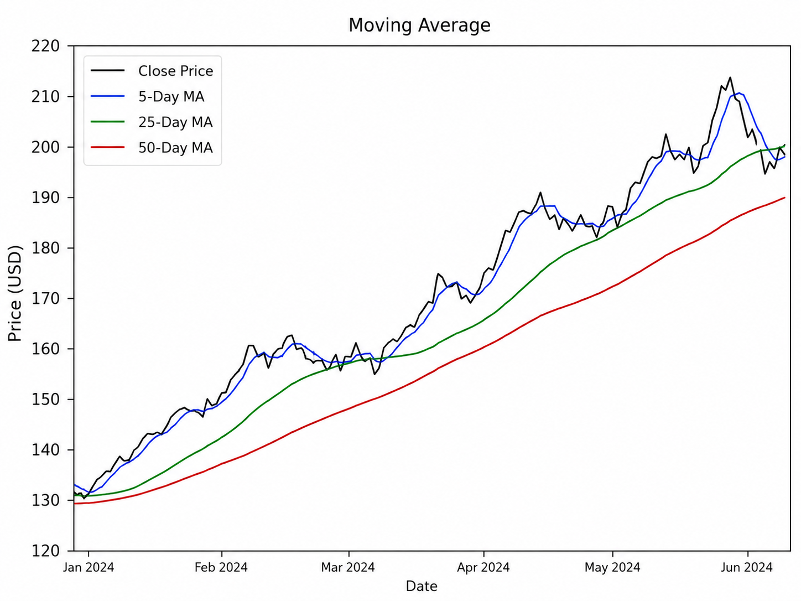
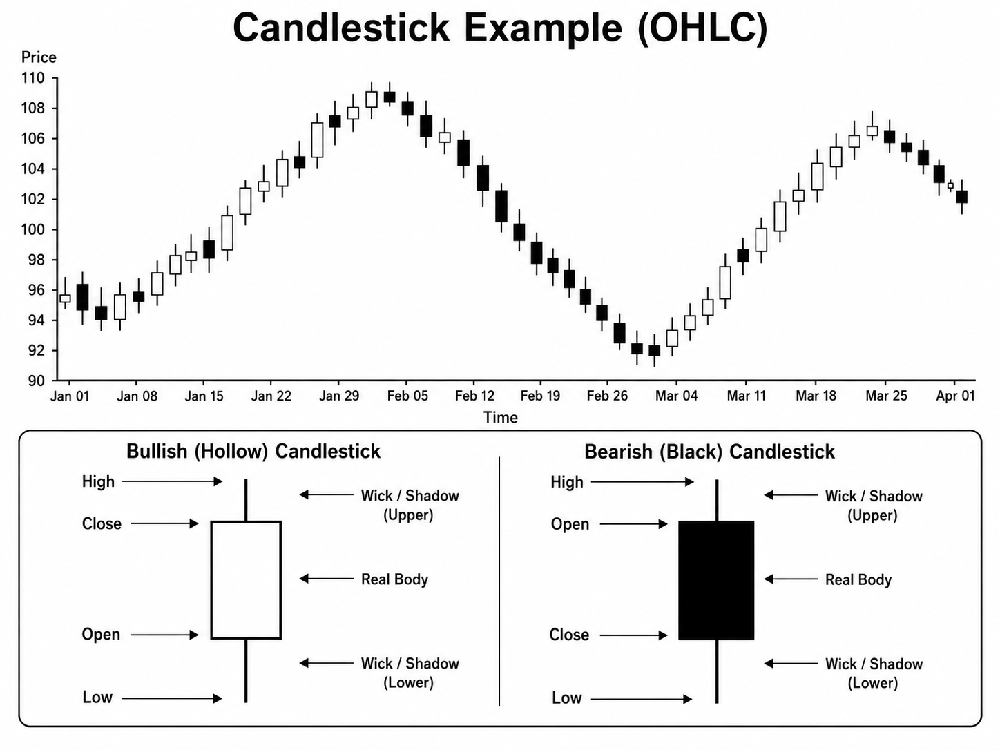

# Stock Price Data Structure

First, I would like to explain some basic stock market terminology.  
This is the minimum knowledge we need to understand stock price data.

You can think of stock market data as a table that records important information about a company and its stock price for a certain day.

## Basic Stock Price Terminology

| Term | Meaning |
|---|---|
| Brand Name | The name of the company or stock. For example, Apple, Toyota, Tesla, etc. |
| Brand Code | The stock code or ticker symbol used to identify the company in the stock market. For example, AAPL for Apple or 7203 for Toyota. |
| Opening Price | The first price of the stock when the market opens. |
| Maximum Price | The highest price of the stock during the trading day. This is also called the high price. |
| Minimum Price | The lowest price of the stock during the trading day. This is also called the low price. |
| Final Price | The last price of the stock when the market closes. This is also called the closing price. |
| Volume | The number of shares traded during the trading day. |

## Example

For example, one row of stock price data may look like this:

| Brand Name | Brand Code | Opening Price | Maximum Price | Minimum Price | Final Price | Volume |
|---|---:|---:|---:|---:|---:|---:|
| Apple | AAPL | 180 | 185 | 178 | 183 | 50,000,000 |

This means that Apple stock started at 180 dollars, reached a highest price of 185 dollars, went down to a lowest price of 178 dollars, and finally closed at 183 dollars.  
The volume means that 50,000,000 shares were traded on that day.

## Why This Data Is Useful

Using this kind of stock price data, we can analyze how the stock price changed during the day.  
For example, we can check whether the price increased or decreased from the opening price to the final price.

## OHLC and OHLCV

This type of stock price data is commonly called **OHLC** or **OHLCV**.

**OHLC** means:

| Letter | Meaning |
|---|---|
| O | Open price |
| H | High price |
| L | Low price |
| C | Close price |

**OHLCV** means OHLC plus volume:

| Letter | Meaning |
|---|---|
| O | Open price |
| H | High price |
| L | Low price |
| C | Close price |
| V | Volume |

So, if the data only contains stock prices, we can call it **OHLC data**.  
If the data also contains trading volume, we can call it **OHLCV data**.

In many stock analysis projects, the basic data table has the following columns:

| Column | Meaning |
|---|---|
| Brand Name | Company or stock name |
| Brand Code | Stock code or ticker symbol |
| Open | First price when the market opens |
| High | Highest price during the trading day |
| Low | Lowest price during the trading day |
| Close | Final price when the market closes |
| Volume | Number of shares traded during the trading day |

## What Are Stock Price Charts?

There are two important types of stock charts that we can look at.  
The first is the **moving average (MA)** chart, which helps us understand the overall trend of a stock price.  
The second is the **candlestick chart**, which shows more detailed information, such as **OHLC** (Open, High, Low, and Close) over a day or another short time period.

### 1. Moving Average (MA)

As mentioned before, a moving average shows the average stock price over the last **n** days, where **n** can be chosen freely.  
For example, if we use 5 days, it is called a **5-day moving average**.

The most basic type of moving average is called the **Simple Moving Average (SMA)**.  
There are several other ways to calculate moving averages. For example, some methods use weighted averages, which place more emphasis on recent data.  
However, in this analysis, I will focus only on the **SMA**.



### 2. Candlestick Chart

A candlestick chart allows us to see **OHLC** data easily in the stock market.  
It shows the **Open**, **High**, **Low**, and **Close** prices for a given day or time interval.

If the **closing price is higher than the opening price**, the rectangular part of the candlestick, called the **real body**, is shown as **hollow**.  
If the **closing price is lower than the opening price**, the real body is shown as **black**.

Candlestick charts were originally developed by **Japanese rice traders in the 18th century**.



## Getting Data Using Python

Now, let's actually get stock price data and plot it using Python.

In this section, we will mainly use **NumPy** and **pandas**.

**NumPy** is a Python library used for numerical and scientific calculations.  
It is useful when we want to work with numbers, arrays, and mathematical operations.

**pandas** is a Python library used for organizing and analyzing data.  
It is especially useful when we want to work with table-like data, similar to an Excel spreadsheet.

In stock analysis, pandas is very useful because stock price data is usually stored in a table format, such as:

| Date | Open | High | Low | Close | Volume |
|---|---:|---:|---:|---:|---:|
| 2024-01-01 | 100 | 105 | 98 | 103 | 1000000 |

Using pandas, we can easily read this data, organize it, calculate moving averages, and make plots.

### Get Data with yfinance

In this project, we will use a Python library called **yfinance** to get stock price data.

At first, I tried to use `pandas-datareader` with Stooq. However, Stooq now requires an API key to download the data directly, so for this beginner project, I will use `yfinance` instead.

`yfinance` allows us to download stock price data from Yahoo Finance. For example, we can download Apple stock data using the ticker symbol `AAPL`.

```Python
import yfinance as yf

# Apple stock data for the last 5 years
df = yf.download("AAPL", period="5y")

print("First 5 rows:")
print(df.head())

print("Last 5 rows:")
print(df.tail())
```

The output will look like this:

```text
First 5 rows:
Price            Close        High         Low        Open    Volume
Ticker            AAPL        AAPL        AAPL        AAPL      AAPL
2021-05-24  123.890968  124.709764  122.760260  122.828492  63092900
2021-05-25  123.696030  125.080183  123.130672  124.592800  72009500
2021-05-26  123.647270  124.173637  123.228127  123.754494  56575900
2021-05-27  122.116920  124.417336  121.921973  123.247636  94625600
2021-05-28  121.463837  122.623794  121.405354  122.399598  71311100

Last 5 rows:
Price            Close        High         Low        Open    Volume
Ticker            AAPL        AAPL        AAPL        AAPL      AAPL
2026-05-18  297.839996  300.660004  294.910004  300.239990  34483000
2026-05-19  298.970001  300.510010  296.350006  296.970001  42243600
2026-05-20  302.250000  302.799988  298.079987  298.179993  38229800
2026-05-21  304.989990  305.540009  300.399994  301.059998  42965100
2026-05-22  308.820007  311.399994  305.839996  306.119995  43627900
```

If we want to change the time range of the downloaded stock data, we can change the `period` option.

For example:

```python
period="1mo"   # 1 month
period="6mo"   # 6 months
period="1y"    # 1 year
period="5y"    # 5 years
period="10y"   # 10 years
period="max"   # all available data
```

As you can see, the stock price data is stored as a **DataFrame**.

A **DataFrame** is a table-like object used in the `pandas` library.  
It is useful for data analysis because it allows us to organize data using rows and columns.

You can think of a DataFrame as something similar to an Excel table or a matrix.

In this example, each row corresponds to a different date.  
The date is used as the **index**.

The columns contain stock price information. In the output from `yfinance`, the columns are displayed in this order:

```text
Close, High, Low, Open, Volume
```

You can further check the index as 
```python
df.index
```

then you will get 

```text
DatetimeIndex(['2021-05-24', '2021-05-25', '2021-05-26', '2021-05-27',
               '2021-05-28', '2021-06-01', '2021-06-02', '2021-06-03',
               '2021-06-04', '2021-06-07',
               ...
               '2026-05-11', '2026-05-12', '2026-05-13', '2026-05-14',
               '2026-05-15', '2026-05-18', '2026-05-19', '2026-05-20',
               '2026-05-21', '2026-05-22'],
              dtype='datetime64[ns]', length=1256, freq=None)
```

so you can see thaa data colun is datatime type data so you can easily manipulate the data. 