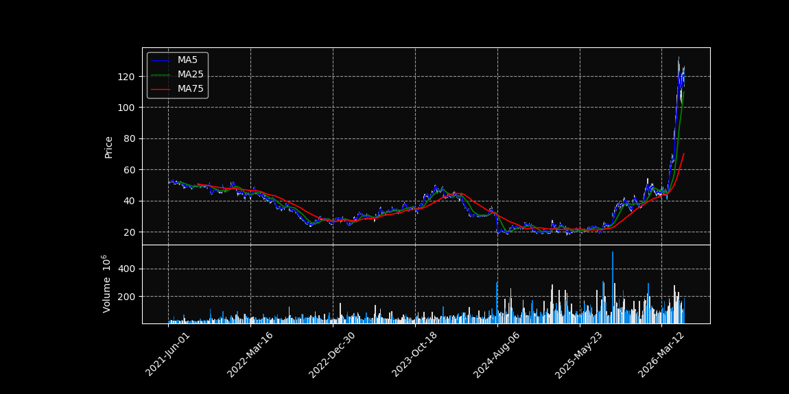
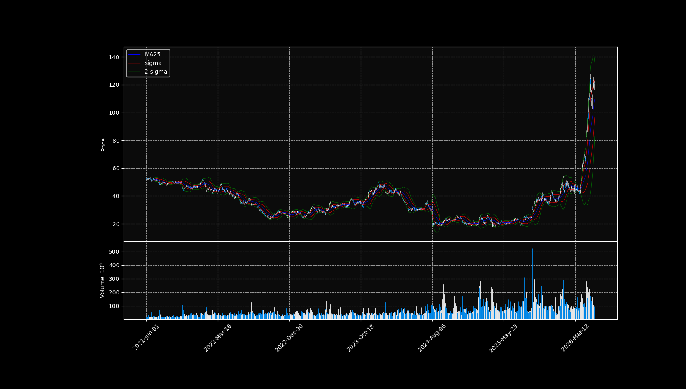

# Stock Price Analysis Intro

In this chapter, I will explain the basic ideas needed to read stock market charts for stock price analysis.

## Trend


As we saw from the Intel candlestick chart with moving averages, stock prices often show a **trend**.

There are three basic types of trends:

| Trend | Meaning |
|---|---|
| Uptrend | The stock price is generally increasing |
| Downtrend | The stock price is generally decreasing |
| Sideways trend | The stock price does not change much and moves within a similar price range |

When the stock price is generally increasing, we call it an **uptrend**.

When the stock price is generally decreasing, we call it a **downtrend**.

When the stock price does not change much and moves around the same price range, we call it a **sideways trend** or a **flat trend**.  
This is also similar to a **range-bound market**.

In general, if moving average lines such as the 25-day MA or 75-day MA are below the candlesticks, the stock may be in an uptrend.

On the other hand, if the moving average lines are above the candlesticks, the stock may be in a downtrend.

However, stock prices do not move in a perfectly smooth line.  
Even during an uptrend or downtrend, the price usually moves in a zigzag pattern because of market randomness, news, and investor behavior.

Of course, a trend does not last forever.  
At some point, the direction of the stock price may change. This is called a **trend reversal**.

There are different trading strategies based on trends.

One common strategy is called a **trend-following strategy**.  
In this strategy, traders buy the stock when it is in an uptrend and sell it when it starts to become a downtrend.  
This is similar to **順張り** in Japanese.

Another strategy is called a **contrarian strategy**.  
In this strategy, traders buy the stock when it is in a downtrend because they expect the price to recover.  
They may also sell the stock when it is in an uptrend because they expect the price to fall soon.  
This is similar to **逆張り** in Japanese.

In simple words:

```text
Trend-following strategy = follow the current trend
Contrarian strategy = go against the current trend
```

These strategies are basic ideas in stock price analysis, but they are not always correct.  
Stock prices can be affected by many factors, so we should not rely on only one signal.tegy which is justr against the trend. 

### Trend Line

A **trend line** is a line that we can draw on top of a candlestick chart to help us understand the direction of the stock price.

For example, we can connect the low prices of several candlesticks.  
This line is often called a **support line**.

A support line shows the price area where the stock price tends to stop falling and may start rising again.

We can also connect the high prices of several candlesticks.  
This line is often called a **resistance line**.

A resistance line shows the price area where the stock price tends to stop rising and may start falling again.

In a downtrend, if the candlestick breaks above the resistance line, it may indicate that the trend is changing from a downtrend to an uptrend.  
This is sometimes called a **breakout**.

On the other hand, in an uptrend, if the candlestick breaks below the support line, it may indicate that the trend is changing from an uptrend to a downtrend.  
This is sometimes called a **breakdown**.

However, one important caveat is that this is not always true.  
Sometimes the price breaks the line temporarily and then returns to the original trend.  
Therefore, traders often use other technical indicators together with trend lines to understand the movement of the stock price more carefully.

From now on, we will look at some of these technical indicators.


### Technical Indicators

Trend lines are useful, but they are often drawn by human intuition.  
Because of this, different people may draw different trend lines on the same chart.

In other words, trend lines are somewhat subjective.

Technical indicators are different because they are calculated using mathematical formulas.  
Therefore, they can give us a more objective way to analyze stock price movement.

There are two main types of technical indicators.

| Type | Purpose | Examples |
|---|---|---|
| Trend indicators | Understand the direction of the trend | Moving Average, Bollinger Bands, MACD |
| Oscillators | Understand whether the market is overbought or oversold | RSI, Stochastic Oscillator, Moving Average Deviation Rate |

The first type is called a **trend indicator**.  
Trend indicators help us understand whether the stock is in an uptrend, downtrend, or sideways trend.

The second type is called an **oscillator**.  
Oscillators help us understand whether the stock price may be too high or too low in the short term.

For example, if many people are buying a stock and the price rises too quickly, the market may be considered **overbought**.  
On the other hand, if many people are selling a stock and the price drops too quickly, the market may be considered **oversold**.

We will first look at trend indicators, and then we will look at oscillators.

Technical analysis usually works better when the stock has high trading volume.  
This is because high-volume stocks have many buyers and sellers, so the price movement may reflect market behavior more clearly.

Another advantage of technical indicators is that they can be calculated automatically using Python.  
This makes them useful for systematic stock analysis.

## Preparation for Technical Analysis

We will use a library called **TA-Lib**.

**TA-Lib** is a Python library used for technical analysis of financial data.  
It contains many useful functions for calculating technical indicators, such as moving averages, RSI, MACD, Bollinger Bands, and many others.

Using TA-Lib, we do not have to write every mathematical formula from scratch.  
Instead, we can use built-in functions to calculate technical indicators more easily.

In TA-Lib, we can use the `SMA()` function to calculate the simple moving average.

```python
import yfinance as yf
import mplfinance as mpf
import matplotlib.pyplot as plt
from matplotlib.lines import Line2D
import talib as ta


intel_df = yf.download("INTC",period="5y")

print(intel_df.head())

intel_df.columns = intel_df.columns.get_level_values(0)
intel_df = intel_df[["Open", "High", "Low", "Close", "Volume"]]

intel_df["ma5"] = ta.SMA(intel_df["Close"], 5)

intel_df["ma25"] = ta.SMA(intel_df["Close"], 25)

intel_df["ma75"] = ta.SMA(intel_df["Close"], 75)

addp = [
    mpf.make_addplot(intel_df["ma5"], color="blue"),
    mpf.make_addplot(intel_df["ma25"], color="green"),
    mpf.make_addplot(intel_df["ma75"], color="red")
]

fig, axes = mpf.plot(intel_df, type="candle", figratio = (2,1), addplot = addp, style= "nightclouds"
         , volume = True, returnfig = True)

legend_lines = [
    Line2D([0], [0], color="blue", label="MA5"),
    Line2D([0], [0], color="green", label="MA25"),
    Line2D([0], [0], color="red", label="MA75")
]

axes[0].legend(handles=legend_lines, loc="upper left")

plt.show()
```

The result will look like this:


## Bollinger Bands 

Lets first try to understamnd the Bollinger line as the first techinical stepos. 

### Bollinger Bands

Let's first understand **Bollinger Bands** as one of the basic technical indicators.

Bollinger Bands were developed by the American investor **John Bollinger**.

The basic idea is to draw bands around a moving average.  
Usually, the center line is a moving average, and the upper and lower bands are calculated using the standard deviation of the stock price.

The standard deviation is often written using the symbol **σ**, called sigma.

For example:

| Band | Meaning |
|---|---|
| Moving Average | Center line |
| +1σ / -1σ | One standard deviation above and below the moving average |
| +2σ / -2σ | Two standard deviations above and below the moving average |
| +3σ / -3σ | Three standard deviations above and below the moving average |

If the data follows a normal distribution, the probability of the data being inside each range is approximately:

| Range | Probability |
|---|---:|
| Within ±1σ | 68.2% |
| Within ±2σ | 95.4% |
| Within ±3σ | 99.7% |

This means that if the stock price moves close to the upper band, the price may be relatively high compared with its recent average.  
If the stock price moves close to the lower band, the price may be relatively low compared with its recent average.

For example, if the stock price reaches around the +2σ or +3σ band, it may suggest that the stock price has moved far above its moving average.  
On the other hand, if the stock price reaches around the -2σ or -3σ band, it may suggest that the stock price has moved far below its moving average.

However, we have to be careful.  
Stock prices do not always follow a perfect normal distribution, so Bollinger Bands should not be used as a perfect prediction tool.

Usually, many traders focus on the ±2σ bands.  
The ±3σ bands are sometimes omitted because they are farther away from the moving average and are reached less often.

Bollinger Bands are useful because they help us understand both the trend and the volatility of the stock price.

Now let's plot Bollinger Bands together with a candlestick chart.

To calculate Bollinger Bands, we can use the `BBANDS()` function in TA-Lib.

The `BBANDS()` function returns three values:

| Output | Meaning |
|---|---|
| `upperband` | Upper Bollinger Band |
| `middleband` | Moving average line |
| `lowerband` | Lower Bollinger Band |

The basic inputs for `BBANDS()` are:

| Input | Meaning |
|---|---|
| `intel_df["Close"]` | Series of closing prices |
| `timeperiod` | Number of days used for the moving average |
| `nbdevup` | Number of standard deviations for the upper band |
| `nbdevdn` | Number of standard deviations for the lower band |
| `matype` | Type of moving average |

In this example, we will use **SMA**, or Simple Moving Average, for the center line.

```python
import yfinance as yf
import mplfinance as mpf
import matplotlib.pyplot as plt
from matplotlib.lines import Line2D
import talib as ta


intel_df = yf.download("INTC",period="5y")

intel_df.columns = intel_df.columns.get_level_values(0)
intel_df = intel_df[["Open", "High", "Low", "Close", "Volume"]]

Close = intel_df["Close"]

intel_df["ma25"] = ta.SMA(intel_df["Close"], 25)

intel_df["Upper1"], _, intel_df["Lower1"]=ta.BBANDS(Close, timeperiod = 25, nbdevup = 1, nbdevdn = 1, matype = ta.MA_Type.SMA)

intel_df["Upper2"], _, intel_df["Lower2"]=ta.BBANDS(Close, timeperiod = 25, nbdevup = 2, nbdevdn = 2, matype = ta.MA_Type.SMA)

addp = [
    mpf.make_addplot(intel_df["ma25"], color="blue",width =0.5),
    mpf.make_addplot(intel_df["Upper1"], color = "red", width = 0.5),
    mpf.make_addplot(intel_df["Lower1"], color = "red", width = 0.5),
    mpf.make_addplot(intel_df["Upper2"], color = "green", width = 0.5),
    mpf.make_addplot(intel_df["Lower2"], color = "green", width = 0.5)
]

fig, axes = mpf.plot(intel_df, type="candle", figratio = (2,1), addplot = addp, style= "nightclouds"
         , volume = True, returnfig = True)

legend_lines = [
    Line2D([0], [0], color="blue", label="MA25"),
    Line2D([0], [0], color="red", label="sigma"),
    Line2D([0], [0], color="green", label="2-sigma")
]

axes[0].legend(handles=legend_lines, loc="upper left")

plt.show()
```
The result will look like this:



As you can see, the stock price movement is mostly confined inside the ±2σ Bollinger Bands.

You can also see some regions where the bands become narrow.  
This is called a **squeeze**.

After a squeeze, the bands often expand again.  
This means that the volatility of the stock price is increasing.

This pattern of contraction and expansion can be repeated in the chart:

```text
band squeeze → band expansion → stronger price movement
```

Bollinger Bands can therefore be used as one signal for buying or selling stocks.

In an uptrend or downtrend, the stock price sometimes moves along the upper or lower band.  
This is called a **band walk**.

For example, after March 2026 in the Intel stock chart, the stock price moves along the band for some time.  
This suggests that the trend may continue.

A band walk often happens between the 1σ and 2σ bands.  
When this happens, traders may use a **trend-following strategy**, expecting the current trend to continue.

Bollinger Bands are also useful when the stock price is moving sideways.  
In a sideways market, we can look at the width of the ±2σ bands and estimate the possible price range.

Another strategy is a **contrarian strategy**.  
For example, if the stock price is near the -2σ band, some traders may expect the price to recover and decide to buy.

However, Bollinger Bands are not perfect.  
The stock price can move outside the bands, and the trend can continue longer than expected.  
Therefore, it is better to use Bollinger Bands together with other technical indicators.
