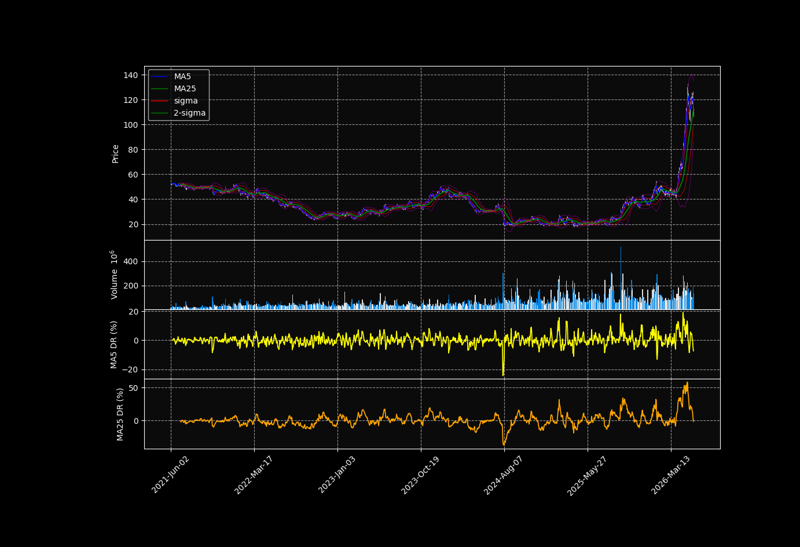

# Bull and Bear

So far, we have learned how to find possible trend change points using moving averages, MACD, Bollinger Bands, and other indicators.

During this process, we saw that stock prices move up and down over time.  
However, we have not yet discussed how strong the upward or downward movement is.

In stock market language, we often use the words **bull** and **bear**.

A **bull market** means that the market or stock price is generally going up.  
A **bear market** means that the market or stock price is generally going down.

| Term | Meaning |
|---|---|
| Bull market | The market is generally rising |
| Bear market | The market is generally falling |
| Bullish | Investors expect the price to go up |
| Bearish | Investors expect the price to go down |

In this section, we will look at oscillator indicators such as **RSI** and **Stochastic Oscillator**.

These indicators help us understand whether the stock price may be **overbought** or **oversold**.

In simple words:

| Condition | Meaning |
|---|---|
| Overbought | The stock may have been bought too much and may be too high |
| Oversold | The stock may have been sold too much and may be too low |

By using RSI and Stochastic Oscillator, we can study not only the direction of the trend, but also the strength of buying and selling pressure.

## Overbought and Oversold

We will learn how to evaluate overbought and oversold conditions using **RSI** and **Stochastic Oscillator**.

However, we have already seen a similar idea when we studied the **deviation rate**.

In this figure, the deviation rate of MA5 oscillates around 0.

This means that the stock price does not stay above the moving average forever.  
It also does not stay below the moving average forever.

When the stock price moves too far above the moving average, the market may become **overbought**.  
When the stock price moves too far below the moving average, the market may become **oversold**.

In many cases, when the market becomes too overbought or too oversold, the price may start moving in the opposite direction.

This is the basic idea behind oscillator indicators.

RSI and Stochastic Oscillator evaluate this idea more systematically and mathematically.  
They help us understand whether buying pressure or selling pressure may be too strong in the short term.

### RSI 
RSI is shirt term for the Relative strength Index developed bu JW wylder. 