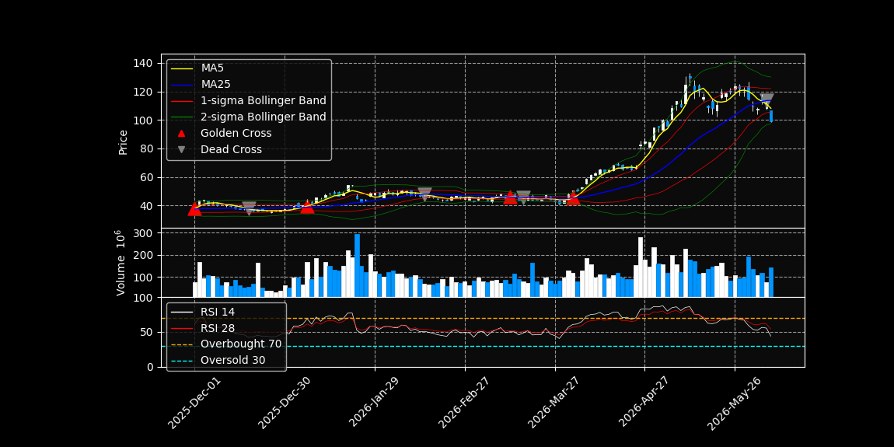
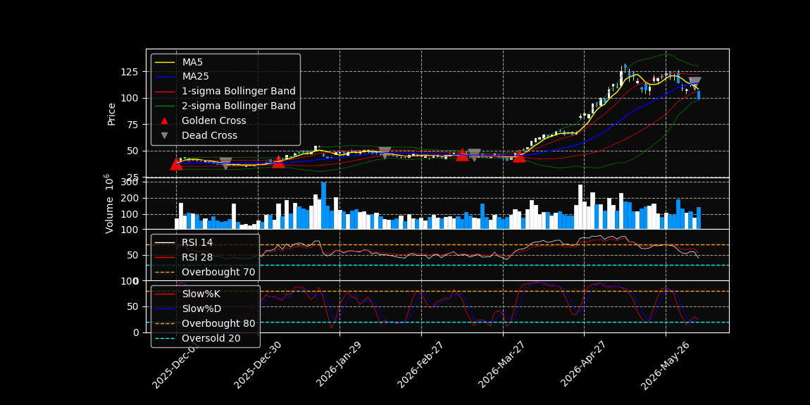
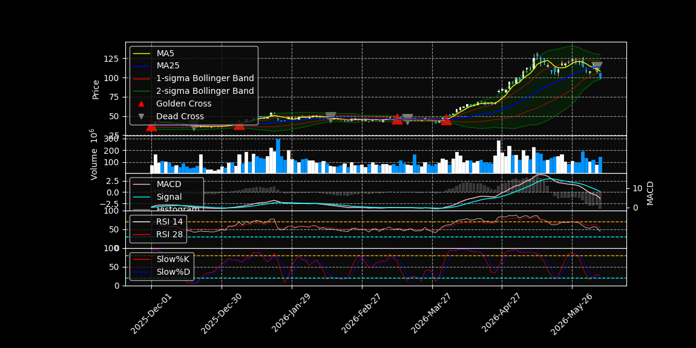

# Bull and Bear

So far, we have learned how to find possible trend change points using moving averages, MACD, Bollinger Bands, and other indicators.

During this process, we saw that stock prices move up and down over time.  
However, we have not yet discussed how strong the upward or downward movement is.

In stock market language, we often use the words **bull** and **bear**.

A **bull market** means that the market or stock price is generally going up.  
A **bear market** means that the market or stock price is generally going down.

| Term | Meaning |
|---|---|
| Bull market | The market is generally rising |
| Bear market | The market is generally falling |
| Bullish | Investors expect the price to go up |
| Bearish | Investors expect the price to go down |

In this section, we will look at oscillator indicators such as **RSI** and **Stochastic Oscillator**.

These indicators help us understand whether the stock price may be **overbought** or **oversold**.

In simple words:

| Condition | Meaning |
|---|---|
| Overbought | The stock may have been bought too much and may be too high |
| Oversold | The stock may have been sold too much and may be too low |

By using RSI and Stochastic Oscillator, we can study not only the direction of the trend, but also the strength of buying and selling pressure.

## Overbought and Oversold

We will learn how to evaluate overbought and oversold conditions using **RSI** and **Stochastic Oscillator**.

However, we have already seen a similar idea when we studied the **deviation rate**.


In this figure, the deviation rate of MA5 oscillates around 0.

This means that the stock price does not stay above the moving average forever.  
It also does not stay below the moving average forever.

When the stock price moves too far above the moving average, the market may become **overbought**.  
When the stock price moves too far below the moving average, the market may become **oversold**.

In many cases, when the market becomes too overbought or too oversold, the price may start moving in the opposite direction.

This is the basic idea behind oscillator indicators.

RSI and Stochastic Oscillator evaluate this idea more systematically and mathematically.  
They help us understand whether buying pressure or selling pressure may be too strong in the short term.

### RSI

**RSI** stands for **Relative Strength Index**.

RSI was developed by **J. Welles Wilder**.  
It is an oscillator indicator that shows how strongly a stock is being bought or sold.

RSI values are shown between **0 and 100**.

| RSI value | Meaning |
|---|---|
| Close to 100 | The stock may be strongly bought |
| Close to 0 | The stock may be strongly sold |
| Above 70 | The stock may be overbought |
| Below 30 | The stock may be oversold |

In general, if the RSI value is above 70, the stock may be considered **overbought**.  
This means the stock price may have risen too much in the short term.

On the other hand, if the RSI value is below 30, the stock may be considered **oversold**.  
This means the stock price may have fallen too much in the short term.

However, RSI is not a perfect signal.  
For example, in a strong uptrend, RSI can stay above 70 for some time.  
In a strong downtrend, RSI can stay below 30 for some time.

We can calculate RSI using the `RSI()` function in TA-Lib.

The input is usually the closing price data:

```python
intel_df["RSI14"] = ta.RSI(intel_df["Close"], timeperiod=14)
intel_df["RSI28"] = ta.RSI(intel_df["Close"], timeperiod=28)
```

Here:

| Code | Meaning |
|---|---|
| `timeperiod=14` | RSI calculated using 14 days |
| `timeperiod=28` | RSI calculated using 28 days |

A common RSI period is **14 days**.  
Sometimes, longer periods such as **28 days** are also used to see a slower and smoother RSI trend.

```python
import yfinance as yf
import pandas as pd
import datetime as dt
import numpy as np
import mplfinance as mpf
import matplotlib.pyplot as plt
from matplotlib.lines import Line2D
import talib as ta

intel_df = yf.download("INTC" , period= "5y")
intel_df.columns = intel_df.columns.get_level_values(0)
intel_df = intel_df[["Open", "High", "Low", "Close", "Volume"]]

Close = intel_df["Close"]

intel_df["ma5"] = ta.SMA(intel_df["Close"], 5)
intel_df["ma25"] = ta.SMA(intel_df["Close"], 25)

cross = intel_df["ma5"] > intel_df["ma25"]
cross_shift = cross.shift(1)

intel_df["cross"] = intel_df["ma5"] > intel_df["ma25"]
intel_df["cross_shift"] = cross_shift

temp_gc = (cross != cross_shift) & (cross==True)
temp_dc = (cross != cross_shift) & (cross==False)

intel_df["temp_gc"] = temp_gc
intel_df["temp_dc"] = temp_dc

intel_df["gc_point"] = intel_df["ma5"].where(intel_df["temp_gc"])
intel_df["dc_point"] = intel_df["ma25"].where(intel_df["temp_dc"])

intel_df["Upper1"], _, intel_df["Lower1"]=ta.BBANDS(Close, timeperiod = 25, nbdevup = 1, nbdevdn = 1, matype = ta.MA_Type.SMA)
intel_df["Upper2"], _, intel_df["Lower2"]=ta.BBANDS(Close, timeperiod = 25, nbdevup = 2, nbdevdn = 2, matype = ta.MA_Type.SMA)

intel_df["RSI14"]=ta.RSI(Close, timeperiod=14)
intel_df["RSI28"]=ta.RSI(Close, timeperiod=28)


plot_df = intel_df["2025-12-01":]

addp = [
    mpf.make_addplot(plot_df["ma5"], color="yellow", width=1),
    mpf.make_addplot(plot_df["ma25"], color="blue", width=1),
    mpf.make_addplot(plot_df["Upper1"], color="red", width=0.5),
    mpf.make_addplot(plot_df["Lower1"], color="red", width=0.5),
    mpf.make_addplot(plot_df["Upper2"], color="green", width=0.5),
    mpf.make_addplot(plot_df["Lower2"], color="green", width=0.5),
    mpf.make_addplot(plot_df["gc_point"], type = "scatter", 
                     markersize = 150, marker = "^", color="red"),
    mpf.make_addplot(plot_df["dc_point"], type = "scatter", 
                     markersize = 150, marker = "v", color="gray"),
    mpf.make_addplot(plot_df["RSI14"], color = "white", width=0.5, panel =2),
    mpf.make_addplot(plot_df["RSI28"], color = "red", width=0.5, panel =2)
]

fig, axes = mpf.plot(plot_df, type="candle", figratio = (2,1), addplot = addp, style= "nightclouds"
         , volume = True, returnfig = True)

legend_lines = [
    Line2D([0], [0], color="yellow", label="MA5"),
    Line2D([0], [0], color="blue", label="MA25"),
    Line2D([0], [0], color="red", label="1-sigma Bollinger Band"),
    Line2D([0], [0], color="green", label="2-sigma Bollinger Band"),
    Line2D([0], [0], marker="^", color="red", linestyle="None", label="Golden Cross"),
    Line2D([0], [0], marker="v", color="gray", linestyle="None", label="Dead Cross")
]

axes[0].legend(handles=legend_lines, loc="upper left")

axes[4].axhline(70, color="orange", linestyle="--", linewidth=1)
axes[4].axhline(30, color="cyan", linestyle="--", linewidth=1)
axes[4].set_ylim(0, 100)

RSI_legend_lines = [
    Line2D([0], [0], color="white", label="RSI 14"),
    Line2D([0], [0], color="red", label="RSI 28"),
    Line2D([0], [0], color="orange", linestyle="--", label="Overbought 70"),
    Line2D([0], [0], color="cyan", linestyle="--", label="Oversold 30")
]

axes[4].legend(handles=RSI_legend_lines, loc="upper left")

plt.show()
```

The result will look like this:



As you can see, when the stock price is in an uptrend, the RSI lines also tend to move upward.

We can also see a similar idea to the golden cross.  
When the short-term RSI, such as RSI14, crosses above the longer-term RSI, such as RSI28, it may suggest that buying pressure is becoming stronger in the short term.

On the other hand, when the stock becomes oversold, the market may bounce back in the opposite direction.

Usually, RSI below 30 is considered oversold, and RSI above 70 is considered overbought.  
However, this rule is not always perfect.

In this Intel example, the lower bound seems to be closer to around 40 rather than 30.  
This means that even when the stock becomes relatively weak, it does not always fall to the typical oversold level of 30.

Also, because Intel is related to the AI and semiconductor market, strong buying pressure can sometimes push RSI above 70.  
This means the stock may become overbought, but it can stay strong for some time during a strong uptrend.

However, when RSI becomes very high, we should be careful.  
A high RSI can suggest that the stock price may be overheated and may later move downward or sideways.

### Divergence of RSI

**Divergence** happens when the direction of the RSI and the direction of the stock price are different.

In other words, the stock price and RSI move in opposite directions.

For example, if the stock price is still going up, but RSI is going down, it may mean that the upward momentum is becoming weaker.

This is called **bearish divergence**.

On the other hand, if the stock price is still going down, but RSI is going up, it may mean that the downward momentum is becoming weaker.

This is called **bullish divergence**.

| Type | Stock price | RSI | Meaning |
|---|---|---|---|
| Bullish divergence | Going down | Going up | Downtrend may become weaker |
| Bearish divergence | Going up | Going down | Uptrend may become weaker |

In many cases, the stock price may later follow the RSI direction with some delay.

This kind of behavior was also seen recently in Intel stock.

### Stochastic Oscillator

The **Stochastic Oscillator** was developed by the American chart analyst **George Lane**.

Like RSI, the Stochastic Oscillator is used to evaluate whether the market is **overbought** or **oversold**.

The difference is that RSI mainly uses the closing price, while the Stochastic Oscillator uses the **high price**, **low price**, and **closing price**.  
Because of this, the Stochastic Oscillator is usually more sensitive to short-term market movement.

There are two main types of Stochastic Oscillator:

| Type | Lines used |
|---|---|
| Fast Stochastic | `%K` and `%D` |
| Slow Stochastic | `Slow %K` and `Slow %D` |

The `%K` line shows where the current closing price is located within a fixed price range.

In simple words, it compares the current closing price with the recent high and low prices.

The `%D` line is the moving average of `%K`.

For **Slow Stochastic**:

| Line | Meaning |
|---|---|
| Slow %K | Smoothed version of fast %K |
| Slow %D | Moving average of Slow %K |

Because Slow Stochastic is smoothed more than Fast Stochastic, it is less sensitive to small price movements.  
For this reason, many traders prefer to use Slow Stochastic.

The Stochastic Oscillator also has values between **0 and 100**.

| Value | Meaning |
|---|---|
| Above 80 | The stock may be overbought |
| Below 20 | The stock may be oversold |

In this project, we will use the `STOCH()` function in TA-Lib.

We will use the following settings:

| Parameter | Value | Meaning |
|---|---:|---|
| `fastk_period` | 5 | Period for fast %K |
| `slowk_period` | 3 | Period for Slow %K |
| `slowd_period` | 3 | Period for Slow %D |
| `slowk_matype` | 0 | SMA for Slow %K |
| `slowd_matype` | 0 | SMA for Slow %D |

Now let's plot Slow Stochastic below the RSI panel.

```python
import yfinance as yf
import pandas as pd
import datetime as dt
import numpy as np
import mplfinance as mpf
import matplotlib.pyplot as plt
from matplotlib.lines import Line2D
import talib as ta

intel_df = yf.download("INTC" , period= "5y")
intel_df.columns = intel_df.columns.get_level_values(0)
intel_df = intel_df[["Open", "High", "Low", "Close", "Volume"]]

Close = intel_df["Close"]

intel_df["ma5"] = ta.SMA(intel_df["Close"], 5)
intel_df["ma25"] = ta.SMA(intel_df["Close"], 25)

cross = intel_df["ma5"] > intel_df["ma25"]
cross_shift = cross.shift(1)

intel_df["cross"] = intel_df["ma5"] > intel_df["ma25"]
intel_df["cross_shift"] = cross_shift

temp_gc = (cross != cross_shift) & (cross==True)
temp_dc = (cross != cross_shift) & (cross==False)

intel_df["temp_gc"] = temp_gc
intel_df["temp_dc"] = temp_dc

intel_df["gc_point"] = intel_df["ma5"].where(intel_df["temp_gc"])
intel_df["dc_point"] = intel_df["ma25"].where(intel_df["temp_dc"])

intel_df["Upper1"], _, intel_df["Lower1"]=ta.BBANDS(Close, timeperiod = 25, nbdevup = 1, nbdevdn = 1, matype = ta.MA_Type.SMA)
intel_df["Upper2"], _, intel_df["Lower2"]=ta.BBANDS(Close, timeperiod = 25, nbdevup = 2, nbdevdn = 2, matype = ta.MA_Type.SMA)

intel_df["RSI14"]=ta.RSI(Close, timeperiod=14)
intel_df["RSI28"]=ta.RSI(Close, timeperiod=28)

intel_df["slowK"], intel_df["slowD"]= ta.STOCH(intel_df["High"], intel_df["Low"],
                Close, fastk_period=5, slowk_period=3, slowd_matype=0,
                slowd_period=3, slowk_matype=0)


plot_df = intel_df["2025-12-01":]

addp = [
    mpf.make_addplot(plot_df["ma5"], color="yellow", width=1),
    mpf.make_addplot(plot_df["ma25"], color="blue", width=1),
    mpf.make_addplot(plot_df["Upper1"], color="red", width=0.5),
    mpf.make_addplot(plot_df["Lower1"], color="red", width=0.5),
    mpf.make_addplot(plot_df["Upper2"], color="green", width=0.5),
    mpf.make_addplot(plot_df["Lower2"], color="green", width=0.5),
    mpf.make_addplot(plot_df["gc_point"], type = "scatter", 
                     markersize = 150, marker = "^", color="red"),
    mpf.make_addplot(plot_df["dc_point"], type = "scatter", 
                     markersize = 150, marker = "v", color="gray"),
    mpf.make_addplot(plot_df["RSI14"], color = "white", width=0.5, panel =2),
    mpf.make_addplot(plot_df["RSI28"], color = "red", width=0.5, panel =2),
    mpf.make_addplot(plot_df["slowK"], color = "red", width = 0.5, panel = 3),
    mpf.make_addplot(plot_df["slowD"], color = "blue", width = 0.5, panel = 3)

]

fig, axes = mpf.plot(plot_df, type="candle", figratio = (2,1), addplot = addp, style= "nightclouds"
         , volume = True, returnfig = True)

legend_lines = [
    Line2D([0], [0], color="yellow", label="MA5"),
    Line2D([0], [0], color="blue", label="MA25"),
    Line2D([0], [0], color="red", label="1-sigma Bollinger Band"),
    Line2D([0], [0], color="green", label="2-sigma Bollinger Band"),
    Line2D([0], [0], marker="^", color="red", linestyle="None", label="Golden Cross"),
    Line2D([0], [0], marker="v", color="gray", linestyle="None", label="Dead Cross")
]

axes[0].legend(handles=legend_lines, loc="upper left")

axes[4].axhline(70, color="orange", linestyle="--", linewidth=1)
axes[4].axhline(30, color="cyan", linestyle="--", linewidth=1)
axes[4].set_ylim(0, 100)

RSI_legend_lines = [
    Line2D([0], [0], color="white", label="RSI 14"),
    Line2D([0], [0], color="red", label="RSI 28"),
    Line2D([0], [0], color="orange", linestyle="--", label="Overbought 70"),
    Line2D([0], [0], color="cyan", linestyle="--", label="Oversold 30")
]

axes[4].legend(handles=RSI_legend_lines, loc="upper left")

axes[6].axhline(80, color="orange", linestyle="--", linewidth=1)
axes[6].axhline(20, color="cyan", linestyle="--", linewidth=1)
axes[6].set_ylim(0, 100)

Stochastics_legend_lines = [
    Line2D([0], [0], color="red", label="Slow%K"),
    Line2D([0], [0], color="blue", label="Slow%D"),
    Line2D([0], [0], color="orange", linestyle="--", label="Overbought 80"),
    Line2D([0], [0], color="cyan", linestyle="--", label="Oversold 20")
]

axes[6].legend(handles=Stochastics_legend_lines, loc="upper left")

plt.show()

```

The result will look like this:



As you can see, even small movements in the stock price can create relatively large movements in the Stochastic Oscillator.

This is because Stochastic Oscillator compares the current closing price with the recent high-low range.  
Therefore, it is sensitive to short-term price movement.

Having both RSI and Stochastic Oscillator is helpful because they look at overbought and oversold conditions in different ways.

If both indicators show that the stock is oversold, the stock price may bounce upward.  
If both indicators show that the stock is overbought, the stock price may later move downward or sideways.

RSI reacts more slowly to market movement, so it is useful for looking at a longer-term trend.

On the other hand, Stochastic Oscillator reacts more quickly to short-term price movement.  
Therefore, it is useful for seeing short-term changes in buying and selling pressure.

In simple words:

| Indicator | Feature | Useful for |
|---|---|---|
| RSI | Slower reaction | Longer-term strength |
| Stochastic Oscillator | Faster reaction | Short-term movement |

Therefore, using both indicators together can give us a better understanding of the market condition.

## Compare MACD, RSI, Stochastics. 

```python
import yfinance as yf
import pandas as pd
import datetime as dt
import numpy as np
import mplfinance as mpf
import matplotlib.pyplot as plt
from matplotlib.lines import Line2D
import talib as ta

intel_df = yf.download("INTC" , period= "5y")
intel_df.columns = intel_df.columns.get_level_values(0)
intel_df = intel_df[["Open", "High", "Low", "Close", "Volume"]]

Close = intel_df["Close"]

intel_df["ma5"] = ta.SMA(intel_df["Close"], 5)
intel_df["ma25"] = ta.SMA(intel_df["Close"], 25)

cross = intel_df["ma5"] > intel_df["ma25"]
cross_shift = cross.shift(1)

intel_df["cross"] = intel_df["ma5"] > intel_df["ma25"]
intel_df["cross_shift"] = cross_shift

temp_gc = (cross != cross_shift) & (cross==True)
temp_dc = (cross != cross_shift) & (cross==False)

intel_df["temp_gc"] = temp_gc
intel_df["temp_dc"] = temp_dc

intel_df["gc_point"] = intel_df["ma5"].where(intel_df["temp_gc"])
intel_df["dc_point"] = intel_df["ma25"].where(intel_df["temp_dc"])

intel_df["Upper1"], _, intel_df["Lower1"]=ta.BBANDS(Close, timeperiod = 25, nbdevup = 1, nbdevdn = 1, matype = ta.MA_Type.SMA)
intel_df["Upper2"], _, intel_df["Lower2"]=ta.BBANDS(Close, timeperiod = 25, nbdevup = 2, nbdevdn = 2, matype = ta.MA_Type.SMA)

intel_df["RSI14"]=ta.RSI(Close, timeperiod=14)
intel_df["RSI28"]=ta.RSI(Close, timeperiod=28)

intel_df["slowK"], intel_df["slowD"]= ta.STOCH(intel_df["High"], intel_df["Low"],
                Close, fastk_period=5, slowk_period=3, slowd_matype=0,
                slowd_period=3, slowk_matype=0)

intel_df["macd"],intel_df["macd_signal"],intel_df["hist"]=ta.MACD(Close, 
                        fastperiod=12, slowperiod= 26, signalperiod=9)


plot_df = intel_df["2025-12-01":]

fill_2sigma = dict(
    y1=plot_df["Upper2"].values,
    y2=plot_df["Lower2"].values,
    alpha=0.15,
    color="green"
)

addp = [
    mpf.make_addplot(plot_df["ma5"], color="yellow", width=1),
    mpf.make_addplot(plot_df["ma25"], color="blue", width=1),
    mpf.make_addplot(plot_df["Upper1"], color="red", width=0.5),
    mpf.make_addplot(plot_df["Lower1"], color="red", width=0.5),
    mpf.make_addplot(plot_df["Upper2"], color="green", width=0.5),
    mpf.make_addplot(plot_df["Lower2"], color="green", width=0.5),
    mpf.make_addplot(plot_df["gc_point"], type = "scatter", 
                     markersize = 150, marker = "^", color="red"),
    mpf.make_addplot(plot_df["dc_point"], type = "scatter", 
                     markersize = 150, marker = "v", color="gray"),
    mpf.make_addplot(plot_df["hist"], panel=2, type="bar", color="gray", alpha=0.4),
    mpf.make_addplot(plot_df["macd"], color="pink", width=1, panel=2, ylabel="MACD"),
    mpf.make_addplot(plot_df["macd_signal"], color="cyan", width=1, panel=2),
    mpf.make_addplot(plot_df["RSI14"], color = "white", width=0.5, panel =3),
    mpf.make_addplot(plot_df["RSI28"], color = "red", width=0.5, panel =3),
    mpf.make_addplot(plot_df["slowK"], color = "red", width = 0.5, panel = 4),
    mpf.make_addplot(plot_df["slowD"], color = "blue", width = 0.5, panel = 4)

]

fig, axes = mpf.plot(plot_df, type="candle", figratio = (2,1), addplot = addp, style= "nightclouds"
         , volume = True, returnfig = True, fill_between={"y1": plot_df["Lower2"].values,
         "y2": plot_df["Upper2"].values, alpha=0.15, color="green"})

legend_lines = [
    Line2D([0], [0], color="yellow", label="MA5"),
    Line2D([0], [0], color="blue", label="MA25"),
    Line2D([0], [0], color="red", label="1-sigma Bollinger Band"),
    Line2D([0], [0], color="green", label="2-sigma Bollinger Band"),
    Line2D([0], [0], marker="^", color="red", linestyle="None", label="Golden Cross"),
    Line2D([0], [0], marker="v", color="gray", linestyle="None", label="Dead Cross")
]

axes[0].legend(handles=legend_lines, loc="upper left")

macd_legend_lines = [
    Line2D([0], [0], color="pink", label="MACD"),
    Line2D([0], [0], color="cyan", label="Signal"),
    Line2D([0], [0], color="gray", label="Histogram")
]

axes[4].legend(handles=macd_legend_lines, loc="upper left")

axes[6].axhline(70, color="orange", linestyle="--", linewidth=1)
axes[6].axhline(30, color="cyan", linestyle="--", linewidth=1)
axes[6].set_ylim(0, 100)

RSI_legend_lines = [
    Line2D([0], [0], color="white", label="RSI 14"),
    Line2D([0], [0], color="red", label="RSI 28"),
    Line2D([0], [0], color="orange", linestyle="--", label="Overbought 70"),
    Line2D([0], [0], color="cyan", linestyle="--", label="Oversold 30")
]

axes[6].legend(handles=RSI_legend_lines, loc="upper left")

axes[8].axhline(80, color="orange", linestyle="--", linewidth=1)
axes[8].axhline(20, color="cyan", linestyle="--", linewidth=1)
axes[8].set_ylim(0, 100)

Stochastics_legend_lines = [
    Line2D([0], [0], color="red", label="Slow%K"),
    Line2D([0], [0], color="blue", label="Slow%D"),
    Line2D([0], [0], color="orange", linestyle="--", label="Overbought 80"),
    Line2D([0], [0], color="cyan", linestyle="--", label="Oversold 20")
]

axes[8].legend(handles=Stochastics_legend_lines, loc="upper left")

plt.show()

```

The result will look like this:

