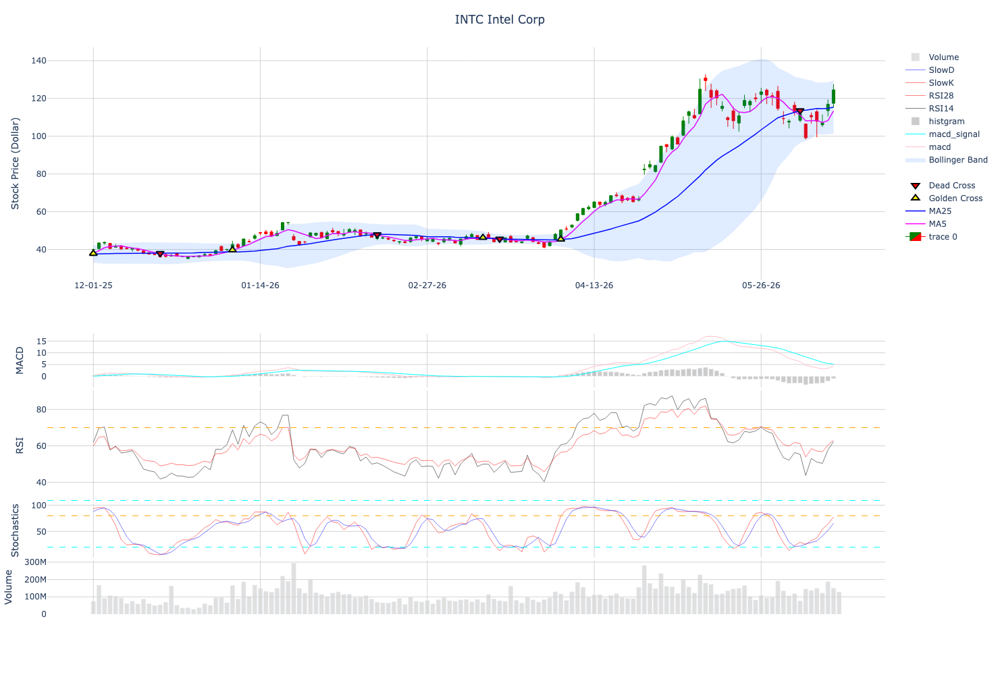
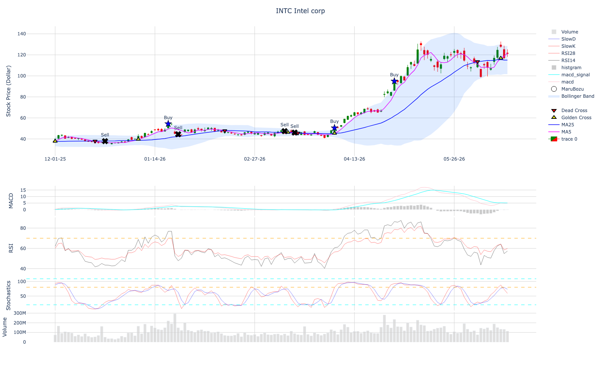
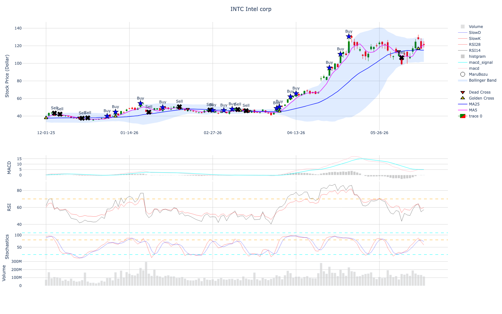

# Famous Strategies in the Stock Market

There are many strategies for deciding when to buy and sell stocks.

One famous strategy is **Granville's rules**.

Granville's rules are based on the relationship between the stock price and a moving average line.

The idea is simple:  
we compare the stock price with a moving average and decide whether the stock may be in a buying or selling condition.

Granville's rules were introduced by **J. E. Granville**.

He recommended using the **200-day moving average**.  
The 200-day moving average is often used because it roughly represents the long-term trend of the market.

However, if we want to trade more frequently, we can use a shorter moving average, such as the 20-day moving average or 25-day moving average.

## Granville's Rules

Granville's rules are usually divided into two groups:

| Type | Meaning |
|---|---|
| Long position | Buy signal |
| Short position | Sell signal |

A **long position** means buying the stock because we expect the price to go up.

A **short position** means selling the stock because we expect the price to go down.

## Long Position

A long position is used when we want to buy the stock.

In general, buy signals are stronger when the moving average is starting to go upward or already moving upward.

### Long Rule 1

The moving average is starting to go upward or moving sideways.  
Then, the stock price crosses above the moving average from below.

This may be a buy signal because the stock price starts moving above the trend line.

### Long Rule 2

The moving average is trending upward.  
Then, the stock price temporarily falls below the moving average but crosses back above it.

This may be a buy signal because the stock price returns to the upward trend.

### Long Rule 3

The moving average is trending upward.  
Then, the stock price moves down close to the moving average but does not clearly break below it.

This may be a buy signal because the moving average acts like a support line.

### Long Rule 4

The moving average is trending downward.  
However, the stock price moves far below the moving average.

This may be a buy signal because the stock price may be oversold and could bounce back.

## Short Position

A short position is used when we want to sell the stock.

In general, sell signals are stronger when the moving average is starting to go downward or already moving downward.

### Short Rule 1

The moving average is starting to go downward or moving sideways.  
Then, the stock price crosses below the moving average from above.

This may be a sell signal because the stock price starts moving below the trend line.

### Short Rule 2

The moving average is trending downward.  
Then, the stock price temporarily rises above the moving average but crosses back below it.

This may be a sell signal because the stock price returns to the downward trend.

### Short Rule 3

The moving average is trending downward.  
Then, the stock price moves up close to the moving average but does not clearly break above it.

This may be a sell signal because the moving average acts like a resistance line.

### Short Rule 4

The moving average is trending upward.  
However, the stock price moves far above the moving average.

This may be a sell signal because the stock price may be overbought and could move downward.

## Beginner's Note

As a beginner, I think Rule 1 and Rule 4 can be difficult to use.

Rule 1 tries to find the beginning of a new trend, but it can be hard to know whether the trend is really changing.

Rule 4 tries to find a rebound or reversal point when the stock price is far away from the moving average, but this is also difficult because the stock price can continue moving in the same direction.

Therefore, it may be better to focus on Rule 2 and Rule 3 first.

Rule 2 and Rule 3 are easier to understand because they are based on an existing trend.

In simple words:

| Rule | Beginner difficulty | Reason |
|---|---|---|
| Rule 1 | Difficult | Tries to find the beginning of a trend |
| Rule 2 | Easier | Uses an existing trend |
| Rule 3 | Easier | Uses the moving average as support or resistance |
| Rule 4 | Difficult | Tries to find a reversal from an extreme condition |

You can use this graph to check possible buy and sell points based on Granville's rules.



In this example, the **25-day moving average** is used as the basic trend line.

When the moving average is trending upward, the stock is generally in an uptrend.  
If the stock price temporarily goes down close to the moving average and then rises again, this can be considered a possible buy point.

This is similar to **Granville's Long Rule 2, 3**.

In simple words:

```text
Moving average is going up
→ stock price falls close to the moving average
→ stock price bounces upward again
→ possible buy point
```

## Using the Candle Stick Pattern

Here I will also introduce analysis using the candle stick pattern. 

### Candlestick Shapes and Meanings

Candlestick charts are used to understand market psychology from stock price movement.

Each candlestick shows the relationship between the **open price**, **high price**, **low price**, and **close price**.

| Japanese name | English name | Meaning |
|---|---|---|
| 大陽線（だいようせん） | Large bullish candlestick | The stock price rises strongly from the opening price and stays near the high price until the close. This suggests strong bullish momentum and the possibility of higher prices in the future. |
| 小陽線（しょうようせん） | Small bullish candlestick | A bullish candlestick with a short body and short upper/lower shadows. It is also called a star candle. It suggests market hesitation and no clear direction. |
| 上影陽線（うわかげようせん） | Bullish candlestick with a long upper shadow | A bullish candlestick with a long upper shadow. The stock price went up during the day, but it could not maintain the high price by the close. This suggests resistance above and possible selling pressure. |
| 下影陽線（したかげようせん） | Bullish candlestick with a long lower shadow | A bullish candlestick with a long lower shadow. It can suggest a possible trend reversal. If it appears at a high price level, it may suggest selling pressure. If it appears at a low price level, it may suggest a buying opportunity. |
| 大陰線（だいいんせん） | Large bearish candlestick | The stock price falls strongly from the opening price and does not recover much by the close. This suggests strong bearish momentum and the possibility of lower prices in the future. |
| 小陰線（しょういんせん） | Small bearish candlestick | A bearish candlestick with a short body and short upper/lower shadows. It is also called a star candle. It suggests market hesitation and no clear direction. |
| 上影陰線（うわかげいんせん） | Bearish candlestick with a long upper shadow | A bearish candlestick with a long upper shadow. The stock price rose after the market opened, but later fell and closed below the opening price. This suggests that selling pressure remained strong toward the close. |
| 下影陰線（したかげいんせん） | Bearish candlestick with a long lower shadow | A bearish candlestick with a long lower shadow. It can suggest a possible trend reversal. If it appears at a high price level, it may suggest selling pressure. If it appears at a low price level, it may suggest a buying opportunity. |
| 寄引同時線（よりひきどうじせん） | Doji candlestick | A candlestick where the opening price and closing price are almost the same. This shows that buyers and sellers are balanced. It may suggest that the market is preparing to move strongly either upward or downward. |

So far, I explained the meaning of each individual candlestick.

However, candlestick analysis does not only use one candlestick.

There are also important candlestick patterns that use one, two, or three candlesticks together.

For example, one candlestick can show whether buyers or sellers were stronger on that day.  
However, two or three candlesticks can show how market psychology is changing over time.

In this section, I will explain several famous candlestick patterns.

For single-candlestick patterns, I will explain **Opening Marubozu** and **Closing Marubozu**.

For two-candlestick patterns, I will explain **Engulfing Patterns** and **Harami Patterns**.

Then, I will explain bullish reversal examples, such as **Bullish Engulfing Pattern** and **Bullish Harami Pattern**.

| Pattern | Meaning |
|---|---|
| Opening Marubozu | A candlestick with no shadow on the opening side |
| Closing Marubozu | A candlestick with no shadow on the closing side |
| Engulfing Pattern | The second candlestick covers the body of the previous candlestick |
| Harami Pattern | The second candlestick is inside the body of the previous candlestick |
| Bullish Engulfing Pattern | A bullish reversal pattern where a bullish candle covers the previous bearish candle |
| Bullish Harami Pattern | A bullish reversal pattern where a small bullish candle appears inside the previous bearish candle |

In simple words:

| Pattern type | Number of candlesticks | Examples |
|---|---:|---|
| Single candlestick pattern | 1 | Opening Marubozu, Closing Marubozu |
| Two-candlestick pattern | 2 | Engulfing Pattern, Harami Pattern |
| Three-candlestick pattern | 3 | Morning Star, Evening Star, Three White Soldiers, Three Black Crows |

These patterns can suggest either **trend continuation** or **trend reversal**.

### Marubozu

A **Marubozu** candlestick is a candlestick with little or no shadow.

In other words, the opening price and closing price are very close to the high or low price.

There are two main types of Marubozu:

| Type | Meaning |
|---|---|
| Bullish Marubozu | Strong buying pressure |
| Bearish Marubozu | Strong selling pressure |

A **Bullish Marubozu** means that the stock price increased strongly during the trading period.

In this case, buyers were stronger than sellers.  
Therefore, it can be interpreted as a possible buy signal.

A **Bearish Marubozu** means that the stock price decreased strongly during the trading period.

In this case, sellers were stronger than buyers.  
Therefore, it can be interpreted as a possible sell signal.

In simple words:

```text
Bullish Marubozu = strong buying pressure
Bearish Marubozu = strong selling pressure
```

We can detect this pattern using the TA-Lib library.

The TA-Lib function for detecting a Marubozu pattern is:

```python
ta.CDLMARUBOZU()
```

The input data are **Open**, **High**, **Low**, and **Close** prices.

```python
df["Marubozu"] = ta.CDLMARUBOZU(df["Open"],df["High"],df["Low"],df["Close"])
```

The return values are:

| Return value | Meaning |
|---:|---|
| 100 | Bullish Marubozu |
| -100 | Bearish Marubozu |
| 0 | No Marubozu pattern |

We can also show Marubozu signals directly on the chart.

To make the chart easier to understand, we replace `100` with `Buy`, `-100` with `Sell`, and `0` with nothing.

We also place the marker at the **High price** of the candlestick.

This makes the signal easy to see above the candlestick.

```python
intel_df["Marubozu_Text"] = intel_df["Marubozu"].replace({100: "Buy",-100: "Sell",0: ""})

intel_df["Marubozu_Marker"] = intel_df["High"].where(intel_df["Marubozu"] != 0)
```
Marubozu patterns are not very common in real stock charts.

This is because a Marubozu candlestick requires little or no upper and lower shadow.

In daily stock data, most candlesticks have some shadow because the price usually moves up and down during the trading day.



### Bullish opening marubozu, Bearishh opening marboze. 

A **Bullish Opening Marubozu** means that the stock opened near the low price and moved upward.

This shows strong buying pressure after the market opened.

A **Bearish Opening Marubozu** means that the stock opened near the high price and moved downward.

This shows strong selling pressure after the market opened.

For detecting **Opening Marubozu**, we can use the TA-Lib function:

```python
ta.CDLBELTHOLD()
```



As you can see more pattern is seen compared to the Marubozu candle stick. 

So far, we have seen the one pattern candle stick pattern but lets talk about the two candle stick pattern. 

### TsuTsumiAsi, Engulfing Pattern

An **Engulfing Pattern** is a two-candlestick pattern.

The second candlestick has a body that covers the body of the previous candlestick.

It can suggest that market psychology is changing.

A **Bullish Engulfing Pattern** may suggest a possible upward reversal.

This pattern appears when the first candlestick is bearish and the second candlestick is bullish.

In this case, the body of the second bullish candlestick covers the body of the first bearish candlestick.

This means that buyers became stronger than sellers.

```text
First day: Bearish candlestick
Second day: Bullish candlestick
→ Possible upward reversal
```

A **Bearish Engulfing Pattern** may suggest a possible downward reversal.

This pattern appears when the first candlestick is bullish and the second candlestick is bearish.

In this case, the body of the second bearish candlestick covers the body of the first bullish candlestick.

This means that sellers became stronger than buyers.

```text
First day: Bullish candlestick
Second day: Bearish candlestick
→ Possible downward reversal
```

In simple words:

| Pattern | First day | Second day | Possible meaning |
|---|---|---|---|
| Bullish Engulfing Pattern | Bearish candlestick | Bullish candlestick | Possible upward reversal |
| Bearish Engulfing Pattern | Bullish candlestick | Bearish candlestick | Possible downward reversal |

The important point is that the **body** of the second candlestick should cover the **body** of the first candlestick.

### Harami Pattern 


A **Harami Pattern** is also a two-candlestick pattern.

The second candlestick is smaller and appears inside the body of the first candlestick.

This means that the strong movement from the first day becomes weaker on the second day.

In simple words:

```text
First candlestick: large body
Second candlestick: small body inside the first body
```

A Harami pattern can suggest that the current trend is losing strength.

## Bullish Harami Pattern

A **Bullish Harami Pattern** may suggest a possible upward reversal.

This pattern usually appears after a downtrend.

The first candlestick is bearish, and the second candlestick is smaller.  
The second candlestick appears inside the body of the first bearish candlestick.

The second candlestick can be either bullish or bearish, but if it is bullish, the reversal signal may look stronger.

```text
First day: Large bearish candlestick
Second day: Small candlestick inside the first body
→ Possible upward reversal
```

## Bearish Harami Pattern

A **Bearish Harami Pattern** may suggest a possible downward reversal.

This pattern usually appears after an uptrend.

The first candlestick is bullish, and the second candlestick is smaller.  
The second candlestick appears inside the body of the first bullish candlestick.

The second candlestick can be either bullish or bearish, but if it is bearish, the reversal signal may look stronger.

```text
First day: Large bullish candlestick
Second day: Small candlestick inside the first body
→ Possible downward reversal
```

In simple words:

| Pattern | First day | Second day | Possible meaning |
|---|---|---|---|
| Bullish Harami Pattern | Large bearish candlestick | Small candlestick inside the first body | Possible upward reversal |
| Bearish Harami Pattern | Large bullish candlestick | Small candlestick inside the first body | Possible downward reversal |

## Engulfing Pattern and Harami Pattern in TA-Lib

Both **Engulfing Pattern** and **Harami Pattern** can be detected using TA-Lib.

| Pattern | TA-Lib method |
|---|---|
| Engulfing Pattern | `CDLENGULFING()` |
| Harami Pattern | `CDLHARAMI()` |

I will omit the Python code here, but the code structure is the same as the Marubozu pattern.

We only need to change the TA-Lib method name.

For example:

```python
ta.CDLENGULFING()
```

or

```python
ta.CDLHARAMI()
```

The return values are also similar:

| Return value | Meaning |
|---:|---|
| 100 | Bullish signal |
| -100 | Bearish signal |
| 0 | No pattern |

### Tsutsumi Age / Tsutsumi Sage and Harami Age / Harami Sage

We can also use **three candlesticks** to guess the possible future movement of the stock price.

These patterns are stronger versions of the two-candlestick patterns.

## Tsutsumi Age and Tsutsumi Sage

**Tsutsumi Age** is related to the **Bullish Engulfing Pattern**.

First, a bullish engulfing pattern appears.  
Then, on the third day, if the stock price rises above the high price of the second day, it can be considered a stronger buy signal.

```text
First and second day: Bullish Engulfing Pattern
Third day: High price becomes higher than the second day's high
→ Stronger buy signal
```

**Tsutsumi Sage** is related to the **Bearish Engulfing Pattern**.

First, a bearish engulfing pattern appears.  
Then, on the third day, if the stock price falls below the low price of the second day, it can be considered a stronger sell signal.

```text
First and second day: Bearish Engulfing Pattern
Third day: Low price becomes lower than the second day's low
→ Stronger sell signal
```

## Harami Age and Harami Sage

This idea is similar for the Harami Pattern.

**Harami Age** is related to the **Bullish Harami Pattern**.

First, a bullish harami pattern appears.  
Then, on the third day, if the stock price rises above the high price of the second day, it can be considered a stronger buy signal.

```text
First and second day: Bullish Harami Pattern
Third day: High price becomes higher than the second day's high
→ Stronger buy signal
```

**Harami Sage** is related to the **Bearish Harami Pattern**.

First, a bearish harami pattern appears.  
Then, on the third day, if the stock price falls below the low price of the second day, it can be considered a stronger sell signal.

```text
First and second day: Bearish Harami Pattern
Third day: Low price becomes lower than the second day's low
→ Stronger sell signal
```

## TA-Lib Methods

We can detect these three-candlestick patterns using TA-Lib.

| Japanese pattern | English idea | TA-Lib method |
|---|---|---|
| 包み上げ / 包み下げ | Three Outside Pattern | `CDL3OUTSIDE()` |
| はらみ上げ / はらみ下げ | Three Inside Pattern | `CDL3INSIDE()` |

For example:

```python
ta.CDL3OUTSIDE()
```

is used for the three-candlestick version of the engulfing pattern.

```python
ta.CDL3INSIDE()
```

is used for the three-candlestick version of the harami pattern.

The return values are similar to other TA-Lib candlestick functions.

| Return value | Meaning |
|---:|---|
| 100 | Bullish signal |
| -100 | Bearish signal |
| 0 | No pattern |

In simple words:

| Pattern | Basic two-candle pattern | Third-day confirmation |
|---|---|---|
| Tsutsumi Age | Bullish Engulfing Pattern | Third day's high becomes higher |
| Tsutsumi Sage | Bearish Engulfing Pattern | Third day's low becomes lower |
| Harami Age | Bullish Harami Pattern | Third day's high becomes higher |
| Harami Sage | Bearish Harami Pattern | Third day's low becomes lower |

These three-candlestick patterns may be stronger than the original two-candlestick patterns because the third candlestick confirms the direction of the price movement.

However, they are still not perfect signals.

It is better to check them together with moving averages, volume, RSI, MACD, and Bollinger Bands.