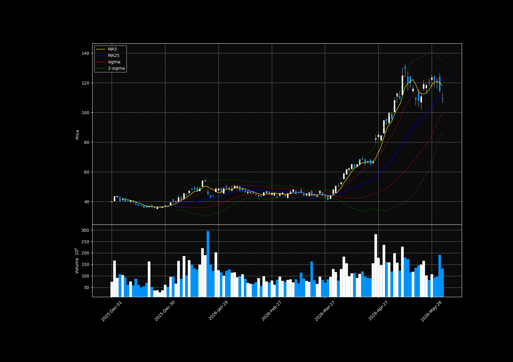

# Moving  Average and its trend change

Here lets see more on the how to read the MA and its relatuion to the stock movement. 

## Dead cross and Golden cross



So far, we have seen that when **MA5 > MA25**, the stock may be in an uptrend.  
On the other hand, when **MA5 < MA25**, the stock may be in a downtrend.

However, there is more information we can get from moving averages and their relationship with the stock price.

One important point is the position of the candlesticks compared with the moving average line.

When the 5-day moving average is rising and the candlesticks are above the MA5 line, it means that the stock price is moving strongly upward.  
In simple words, many investors are willing to buy the stock at higher prices.

This can suggest that the stock is popular and that the buying pressure is strong.

On the other hand, when the 5-day moving average is falling and the candlesticks are below the MA5 line, it means that the stock price is moving downward.  
In this case, investors may not want to buy the stock at higher prices, and the stock may be less popular.

So, the relationship between the candlesticks and the moving average can help us understand the strength of the trend.

### Golden Cross and Dead Cross

We can also use moving averages to find possible trend change points.

For example, around March 27, 2026, we can see that the 5-day moving average moves from below the 25-day moving average to above the 25-day moving average.

This situation is called a **golden cross**.

A **golden cross** happens when a short-term moving average crosses above a long-term moving average.  
This can be a signal that the stock price may start rising.

In this case:

```text
MA5 crosses above MA25
```

This suggests that the short-term trend is becoming stronger than the medium-term trend.

However, one important point is that the 25-day moving average should also start moving upward.  
If the 25-day moving average is still strongly decreasing, the golden cross may not be a strong signal.

Another important point is the angle between the 5-day MA and the 25-day MA.

If the angle between the two moving averages is steep, the trend change may be stronger.  
If the angle is small and the two lines are almost flat, the signal may be weaker.

Around the golden cross, we can also see that the candlesticks are above the 5-day moving average.  
This means that the stock price is stronger than the short-term average.

In simple words, many traders may be willing to buy the stock at higher prices, so the stock may be becoming popular.

Therefore, when we look at a golden cross, we should check several points:

| Point | Meaning |
|---|---|
| MA5 crosses above MA25 | Possible trend change to an uptrend |
| MA25 is also moving upward | The trend change may be stronger |
| The angle between MA5 and MA25 is steep | The momentum may be stronger |
| Candlesticks are above MA5 | Buying pressure may be strong |

The same idea is also true for a **dead cross**.

A **dead cross** happens when a short-term moving average crosses below a long-term moving average.

For example:

```text
MA5 crosses below MA25
```

This can be a signal that the stock price may start falling.

In the Intel chart, we can see an example of this between January and February 2026.  
Around this period, the 5-day moving average moves from above the 25-day moving average to below it.

This suggests that the short-term trend became weaker than the medium-term trend.

Therefore:

| Signal | Meaning |
|---|---|
| Golden cross | MA5 crosses above MA25, possible uptrend signal |
| Dead cross | MA5 crosses below MA25, possible downtrend signal |


## Showing the trend change in candle charts. 

The basic logic is to compare the values of the 5-day moving average and the 25-day moving average.

If the 5-day moving average crosses above the 25-day moving average, it is called a **golden cross**.  
If the 5-day moving average crosses below the 25-day moving average, it is called a **dead cross**.

In Python, we can detect this by checking when the relationship between MA5 and MA25 changes.

```python 
import yfinance as yf
import pandas as pd
import datetime as dt
import numpy as np
import mplfinance as mpf
import matplotlib.pyplot as plt
from matplotlib.lines import Line2D
import talib as ta

intel_df = yf.download("INTC" , period= "5y")
intel_df.columns = intel_df.columns.get_level_values(0)
intel_df = intel_df[["Open", "High", "Low", "Close", "Volume"]]

Close = intel_df["Close"]

intel_df["ma5"] = ta.SMA(intel_df["Close"], 5)
intel_df["ma25"] = ta.SMA(intel_df["Close"], 25)

cross = intel_df["ma5"] > intel_df["ma25"]
cross_shift = cross.shift(1)

intel_df["cross"] = intel_df["ma5"] > intel_df["ma25"]
intel_df["cross_shift"] = cross_shift

temp_gc = (cross != cross_shift) & (cross==True)
temp_dc = (cross != cross_shift) & (cross==False)

intel_df["temp_gc"] = temp_gc
intel_df["temp_dc"] = temp_dc

intel_df["gc_point"] = intel_df["ma5"].where(intel_df["temp_gc"])
intel_df["dc_point"] = intel_df["ma25"].where(intel_df["temp_dc"])

intel_df["Upper1"], _, intel_df["Lower1"]=ta.BBANDS(Close, timeperiod = 25, nbdevup = 1, nbdevdn = 1, matype = ta.MA_Type.SMA)
intel_df["Upper2"], _, intel_df["Lower2"]=ta.BBANDS(Close, timeperiod = 25, nbdevup = 2, nbdevdn = 2, matype = ta.MA_Type.SMA)

plot_df = intel_df["2025-12-01":]

addp = [
    mpf.make_addplot(plot_df["ma5"], color="yellow", width=1),
    mpf.make_addplot(plot_df["ma25"], color="blue", width=1),
    mpf.make_addplot(plot_df["Upper1"], color="red", width=0.5),
    mpf.make_addplot(plot_df["Lower1"], color="red", width=0.5),
    mpf.make_addplot(plot_df["Upper2"], color="green", width=0.5),
    mpf.make_addplot(plot_df["Lower2"], color="green", width=0.5),
    mpf.make_addplot(plot_df["gc_point"], type = "scatter", 
                     markersize = 150, marker = "^", color="red"),
    mpf.make_addplot(plot_df["dc_point"], type = "scatter", 
                     markersize = 150, marker = "v", color="gray"),
]

fig, axes = mpf.plot(plot_df, type="candle", figratio = (2,1), addplot = addp, style= "nightclouds"
         , volume = True, returnfig = True)

legend_lines = [
    Line2D([0], [0], color="yellow", label="MA5"),
    Line2D([0], [0], color="blue", label="MA25"),
    Line2D([0], [0], color="red", label="1-sigma Bollinger Band"),
    Line2D([0], [0], color="green", label="2-sigma Bollinger Band"),
    Line2D([0], [0], marker="^", color="red", linestyle="None", label="Golden Cross"),
    Line2D([0], [0], marker="v", color="gray", linestyle="None", label="Dead Cross")
]

axes[0].legend(handles=legend_lines, loc="upper left")

plt.show()
```

In this code, I also added Bollinger Bands and the 5-day and 25-day moving averages.

The red triangle marker shows where the **golden cross** happens.  
The gray triangle marker shows where the **dead cross** happens.

The result will look like this:


As you can see, after the golden cross happens, the stock price starts going up.

However, one important point is that the 25-day moving average should also start moving upward.  
If the 25-day moving average is still going down, the golden cross may not be a strong signal.

Therefore, we should not use the golden cross alone.  
It is better to check it together with the direction of the 25-day moving average, volume, Bollinger Bands, and other technical indicators.

## Moving Average Convergence Divergence (MACD)

Other possible indicator is MACD, this indicators was developed by Gerald Appel in the late 1970s. This indicator use the MA.