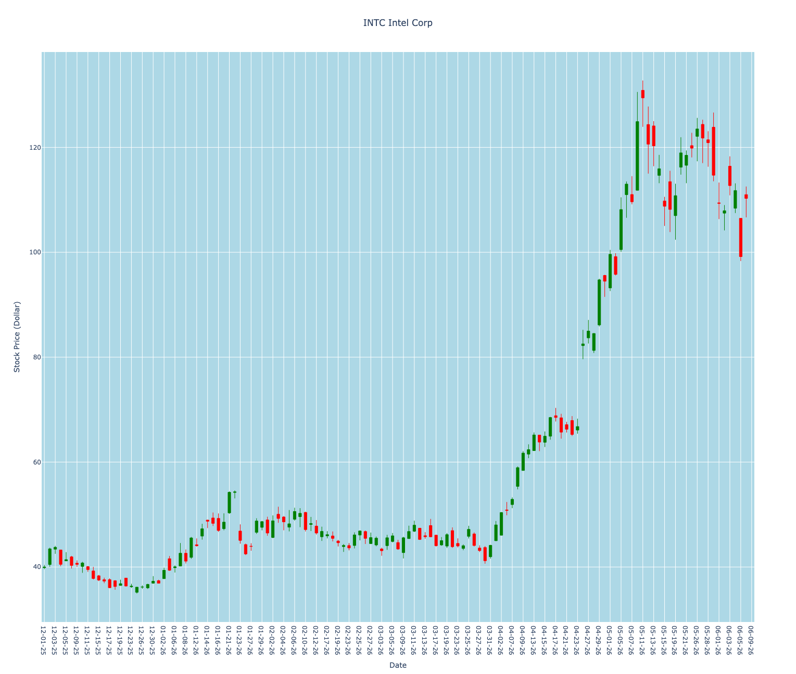
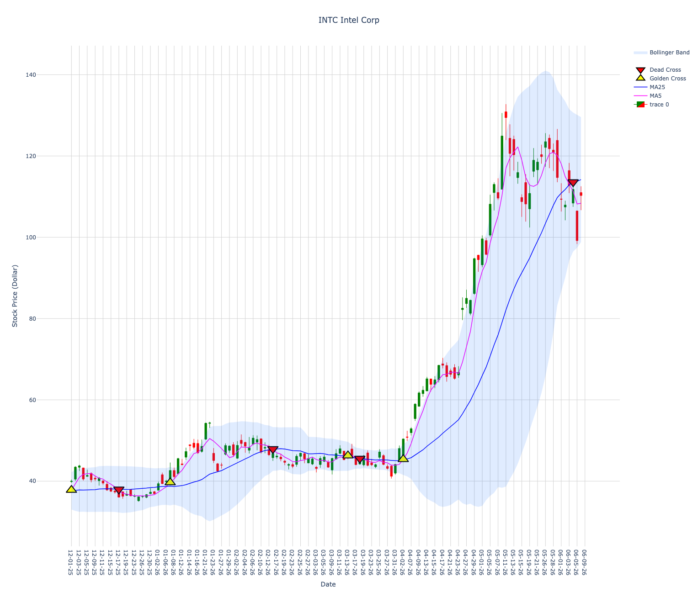
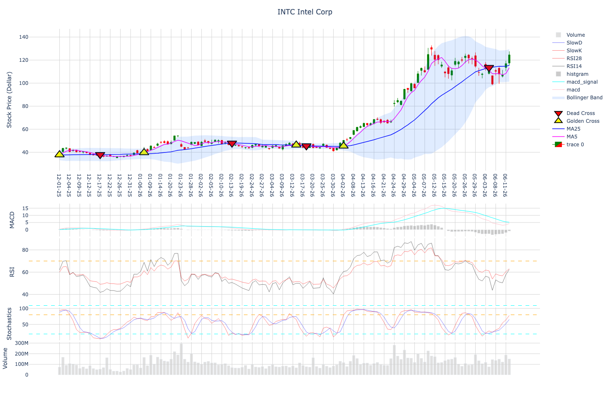

# Plotly

So far, we have mainly used `matplotlib` and `mplfinance` to plot stock charts.

In this section, we will learn a more interactive way to show stock charts and technical indicators.

We will use **Plotly**.

Plotly is a Python library that can create interactive charts using JavaScript in the background.  
This means that when we open the chart in a browser, we can zoom in, zoom out, move around, and check values by moving the mouse over the chart.

First, let's see a very simple example.

```python
import plotly.graph_objects as go
import plotly.io as pio

x = [1, 2, 3, 4, 5]
y = [10, 20, 30, 40, 50]

data = go.Bar(x=x, y=y)

fig = go.Figure(data)
fig.show()
```

Here is the result.


This figure is saved as a PNG file.

However, when you run the Python code, the chart opens in a browser as an interactive graph.  
This means you can zoom in, zoom out, and move your mouse over the bars to see the values.

## Making Candlestick Charts Using Plotly

Next, we will make a candlestick chart using Plotly.

To make a candlestick chart, we use the `Candlestick()` function from `plotly.graph_objects`.

A candlestick chart needs four important stock prices:

| Price | Meaning |
|---|---|
| Open | The price when the market opens |
| High | The highest price during the day |
| Low | The lowest price during the day |
| Close | The price when the market closes |

In Plotly, we can write the candlestick chart like this:

```python 
import yfinance as yf 
import pandas as pd
import datetime as dt
import numpy as np
import mplfinance as mpf
import matplotlib.pyplot as plt
from matplotlib.lines import Line2D
import talib as ta
import plotly.graph_objects as go
import plotly.io as pio

ticker = "INTC"
name = "Intel Corp" 

intel_df= yf.download("INTC", period="5y")
intel_df.columns = intel_df.columns.get_level_values(0)
intel_df = intel_df[["Open", "High", "Low", "Close", "Volume"]]

plot_df = intel_df["2025-12-01":]

data = [go.Candlestick(x = plot_df.index, open = plot_df["Open"], 
        high = plot_df["High"], low = plot_df["Low"], close=plot_df["Close"],
        increasing_line_color = "green",
        increasing_line_width = 1.0,
        increasing_fillcolor = "green",
        decreasing_line_color = "red",
        decreasing_line_width = 1.0,
        decreasing_fillcolor = "red")
        ]

layout = {"title" : {"text":"{} {}".format(ticker, name), "x": 0.5},
          "xaxis": {"title": "Date", "rangeslider": {"visible": False} },
          "yaxis": {"title": "Stock Price (Dollar)", "side":"left", "tickformat":","},
          "plot_bgcolor":"light blue"
}

fig = go.Figure(data=data, layout=go.Layout(layout))

fig.show()
```

The result looks like this:


Here, I took a screenshot of the HTML output to show the interactivity of Plotly.

As you can see, there are empty regions in the candlestick chart where the stock market was closed.  
For example, the stock market is usually closed on weekends and holidays.

Because no stock price data exists on those days, it is common to remove those empty dates from the chart.

```python 
import yfinance as yf 
import pandas as pd
import datetime as dt
import numpy as np
import mplfinance as mpf
import matplotlib.pyplot as plt
from matplotlib.lines import Line2D
import talib as ta
import plotly.graph_objects as go
import plotly.io as pio

ticker = "INTC"
name = "Intel Corp" 

intel_df= yf.download("INTC", period="5y")
intel_df.columns = intel_df.columns.get_level_values(0)
intel_df = intel_df[["Open", "High", "Low", "Close", "Volume"]]

plot_df = intel_df["2025-12-01":]
plot_df.index = pd.to_datetime(plot_df.index).strftime("%m-%d-%y")

data = [go.Candlestick(x = plot_df.index, open = plot_df["Open"], 
        high = plot_df["High"], low = plot_df["Low"], close=plot_df["Close"],
        increasing_line_color = "green",
        increasing_line_width = 1.0,
        increasing_fillcolor = "green",
        decreasing_line_color = "red",
        decreasing_line_width = 1.0,
        decreasing_fillcolor = "red")
        ]

layout = {"title" : {"text":"{} {}".format(ticker, name), "x": 0.5},
          "xaxis": {"title": "Date", "rangeslider": {"visible": False} ,"type": "category","tickvals": plot_df.index[::2]},
          "yaxis": {"title": "Stock Price (Dollar)", "side":"left", "tickformat":","},
          "plot_bgcolor":"lightblue"
}

fig = go.Figure(data=data, layout=go.Layout(layout))

fig.show()
```

The result looks like this:



Now the dates when the stock market was closed are skipped.

The important part is this:

```python
plot_df.index = pd.to_datetime(plot_df.index).strftime("%m-%d-%y")
```

This converts the date index from a datetime format into a string format.

Then, in the layout, we write:

```python
"type": "category"
```

This tells Plotly to treat the x-axis as category labels, not as continuous calendar time.

Because of this, Plotly only shows the dates that exist in the stock price data.  
Therefore, weekends and holidays are removed from the chart.

We also used:

```python
"tickvals": plot_df.index[::2]
```

This means that the x-axis shows every second date label.  
This makes the x-axis easier to read because too many date labels can become crowded.

## Adding Moving Averages, Golden Cross, Dead Cross, and Bollinger Bands in Plotly

Next, we will add **5-day moving average**, **25-day moving average**, **golden cross**, **dead cross**, and **Bollinger Bands** to the Plotly candlestick chart.

We will calculate the moving averages and Bollinger Bands using the **TA-Lib** library.

We will also use `go.Scatter()` from Plotly to add line plots and marker plots on top of the candlestick chart.


Lets now write the 5days and 25days MA, Golden Cross and dead cross and Bollinger bands using TA-Lib library and scatter method of the plotly. 

```python
import yfinance as yf 
import pandas as pd
import datetime as dt
import numpy as np
import mplfinance as mpf
import matplotlib.pyplot as plt
from matplotlib.lines import Line2D
import talib as ta
import plotly.graph_objects as go
import plotly.io as pio

ticker = "INTC"
name = "Intel Corp" 

intel_df= yf.download("INTC", period="5y")
intel_df.columns = intel_df.columns.get_level_values(0)
intel_df = intel_df[["Open", "High", "Low", "Close", "Volume"]]

Close= intel_df["Close"]

intel_df["ma5"]= ta.SMA(Close, 5)
intel_df["ma25"]= ta.SMA(Close, 25)

cross = intel_df["ma5"] > intel_df["ma25"]
cross_shift = cross.shift(1)

intel_df["cross"] = intel_df["ma5"] > intel_df["ma25"]
intel_df["cross_shift"] = cross_shift

temp_gc = (cross != cross_shift) & (cross==True)
temp_dc = (cross != cross_shift) & (cross==False)

intel_df["temp_gc"] = temp_gc
intel_df["temp_dc"] = temp_dc

intel_df["gc_point"] = intel_df["ma5"].where(intel_df["temp_gc"])
intel_df["dc_point"] = intel_df["ma25"].where(intel_df["temp_dc"])

intel_df["Upper1"], _, intel_df["Lower1"]=ta.BBANDS(Close, timeperiod = 25, nbdevup = 1, nbdevdn = 1, matype = ta.MA_Type.SMA)
intel_df["Upper2"], _, intel_df["Lower2"]=ta.BBANDS(Close, timeperiod = 25, nbdevup = 2, nbdevdn = 2, matype = ta.MA_Type.SMA)

plot_df = intel_df["2025-12-01":]
plot_df.index = pd.to_datetime(plot_df.index).strftime("%m-%d-%y")

data = [go.Candlestick(x = plot_df.index, open = plot_df["Open"], 
        high = plot_df["High"], low = plot_df["Low"], close=plot_df["Close"],
        increasing_line_color = "green",
        increasing_line_width = 1.0,
        increasing_fillcolor = "green",
        decreasing_line_color = "red",
        decreasing_line_width = 1.0,
        decreasing_fillcolor = "red"),

        go.Scatter(x=plot_df.index, y = plot_df["ma5"], name = "MA5", line=dict(color="#ff00ff", width=1.5)),

        go.Scatter(x=plot_df.index, y = plot_df["ma25"], name = "MA25", line={"color":"blue", "width":1.5}),

        go.Scatter(x=plot_df.index, y= plot_df["gc_point"], name="Golden Cross",  mode="markers", 
                   marker=dict(size=20, color="yellow", symbol="triangle-up",
                           line=dict(color="black", width=2))),

        go.Scatter(x=plot_df.index, y= plot_df["dc_point"], name="Dead Cross", mode="markers", 
                   marker=dict(color="red",size=20,symbol="triangle-down",line=dict(color="black", width=2))),
        
        go.Scatter(x=plot_df.index, y = plot_df["Upper2"], name="",line={"color": "white", "width":0}),

        go.Scatter(x=plot_df.index, y = plot_df["Lower2"], name="Bollinger Band",line={"color": "white", "width":0},
                   fill="tonexty", fillcolor="rgba(0, 102, 255, 0.12)"),
        ]

layout = {"title" : {"text":"{} {}".format(ticker, name), "x": 0.5},
          "xaxis": {"title": "Date", "rangeslider": {"visible": False} ,"type": "category","tickvals": plot_df.index[::2]},
          "yaxis": {"title": "Stock Price (Dollar)", "side":"left", "tickformat":","},
          "plot_bgcolor": "white","paper_bgcolor": "white"
}

fig = go.Figure(data=data, layout=go.Layout(layout))

fig.update_xaxes(showgrid=True, gridcolor="lightgray")
fig.update_yaxes(showgrid=True, gridcolor="lightgray")

fig.show()
```

The result looks like this:



In this figure, I changed the background color from light blue to white.

The **golden cross** is shown as a yellow triangle-up marker with a black outline.  
The **dead cross** is shown as a red triangle-down marker with a black outline.

The **Bollinger Band** is shown as a light blue shaded region between the upper 2σ band and the lower 2σ band.

In this plot, the 1σ Bollinger Band lines are omitted to make the chart simpler and easier to read.

The important part for the Bollinger Band shadow is:

```python
go.Scatter(
    x=plot_df.index,
    y=plot_df["Upper2"],
    name="Upper 2σ",
    line=dict(color="white", width=0),
    showlegend=False
),

go.Scatter(
    x=plot_df.index,
    y=plot_df["Lower2"],
    name="Bollinger Band",
    line=dict(color="white", width=0),
    fill="tonexty",
    fillcolor="rgba(0, 102, 255, 0.12)"
)
```

Here, `fill="tonexty"` fills the region between the current line and the previous line.

Because the previous line is `Upper2` and the current line is `Lower2`, Plotly fills the region between the upper 2σ Bollinger Band and the lower 2σ Bollinger Band.

## Adding Volume, MACD ,RSI, Stochastics
Now lets add the volume below the data region. We will use the domain property. Basically we can us ethis inside of the layout. We need to first think about the layoput, We will put date and MACD, RSI, Stochastics, volume.

```python
import yfinance as yf 
import pandas as pd
import datetime as dt
import numpy as np
import mplfinance as mpf
import matplotlib.pyplot as plt
from matplotlib.lines import Line2D
import talib as ta
import plotly.graph_objects as go
import plotly.io as pio

ticker = "INTC"
name = "Intel Corp" 

intel_df= yf.download("INTC", period="5y")
intel_df.columns = intel_df.columns.get_level_values(0)
intel_df = intel_df[["Open", "High", "Low", "Close", "Volume"]]

Close= intel_df["Close"]

intel_df["ma5"]= ta.SMA(Close, 5)
intel_df["ma25"]= ta.SMA(Close, 25)

cross = intel_df["ma5"] > intel_df["ma25"]
cross_shift = cross.shift(1)

intel_df["cross"] = intel_df["ma5"] > intel_df["ma25"]
intel_df["cross_shift"] = cross_shift

temp_gc = (cross != cross_shift) & (cross==True)
temp_dc = (cross != cross_shift) & (cross==False)

intel_df["temp_gc"] = temp_gc
intel_df["temp_dc"] = temp_dc

intel_df["gc_point"] = intel_df["ma5"].where(intel_df["temp_gc"])
intel_df["dc_point"] = intel_df["ma25"].where(intel_df["temp_dc"])

intel_df["Upper1"], _, intel_df["Lower1"]=ta.BBANDS(Close, timeperiod = 25, nbdevup = 1, nbdevdn = 1, matype = ta.MA_Type.SMA)
intel_df["Upper2"], _, intel_df["Lower2"]=ta.BBANDS(Close, timeperiod = 25, nbdevup = 2, nbdevdn = 2, matype = ta.MA_Type.SMA)

intel_df["RSI14"]=ta.RSI(Close, timeperiod=14)
intel_df["RSI28"]=ta.RSI(Close, timeperiod=28)

intel_df["slowK"], intel_df["slowD"]= ta.STOCH(intel_df["High"], intel_df["Low"],
                Close, fastk_period=5, slowk_period=3, slowd_matype=0,
                slowd_period=3, slowk_matype=0)

intel_df["macd"],intel_df["macd_signal"],intel_df["hist"]=ta.MACD(Close, 
                        fastperiod=12, slowperiod= 26, signalperiod=9)

plot_df = intel_df["2025-12-01":]
plot_df.index = pd.to_datetime(plot_df.index).strftime("%m-%d-%y")

data = [go.Candlestick(x = plot_df.index, open = plot_df["Open"], 
        high = plot_df["High"], low = plot_df["Low"], close=plot_df["Close"],
        increasing_line_color = "green",
        increasing_line_width = 1.0,
        increasing_fillcolor = "green",
        decreasing_line_color = "red",
        decreasing_line_width = 1.0,
        decreasing_fillcolor = "red"),

        go.Scatter(yaxis="y1",x=plot_df.index, y = plot_df["ma5"], name = "MA5", line=dict(color="#ff00ff", width=1.5)),

        go.Scatter(yaxis="y1",x=plot_df.index, y = plot_df["ma25"], name = "MA25", line={"color":"blue", "width":1.5}),

        go.Scatter(yaxis="y1",x=plot_df.index, y= plot_df["gc_point"], name="Golden Cross",  mode="markers", 
                   marker=dict(size=20, color="yellow", symbol="triangle-up",
                           line=dict(color="black", width=2))),

        go.Scatter(yaxis="y1",x=plot_df.index, y= plot_df["dc_point"], name="Dead Cross", mode="markers", 
                   marker=dict(color="red",size=20,symbol="triangle-down",line=dict(color="black", width=2))),
        
        go.Scatter(yaxis="y1",x=plot_df.index, y = plot_df["Upper2"], name="",line={"color": "white", "width":0}),

        go.Scatter(yaxis="y1",x=plot_df.index, y = plot_df["Lower2"], name="Bollinger Band",line={"color": "white", "width":0},
                   fill="tonexty", fillcolor="rgba(0, 102, 255, 0.12)"),

        go.Scatter(yaxis="y3", x=plot_df.index, y= plot_df["macd"], name="macd", line={"color":"pink", "width":1}),
        go.Scatter(yaxis="y3", x=plot_df.index, y= plot_df["macd_signal"], name="macd_signal", line={"color":"cyan", "width":1}),
        go.Bar(yaxis="y3", x=plot_df.index, y= plot_df["hist"], name="histgram", marker=dict(color="gray"),
                        opacity=0.4),

        go.Scatter(yaxis= "y4", x=plot_df.index, y = plot_df["RSI14"], name= "RSI14", line={"color": "black", "width" :0.5}),
        go.Scatter(yaxis= "y4", x=plot_df.index, y = plot_df["RSI28"], name= "RSI28", line={"color": "red", "width" :0.5}),

        go.Scatter(yaxis="y5", x=plot_df.index, y = plot_df["slowK"], name="SlowK", line={"color": "red", "width":0.5}),
        go.Scatter(yaxis="y5", x=plot_df.index, y = plot_df["slowD"], name="SlowD", line={"color": "blue", "width":0.5}),

        go.Bar(x=plot_df.index, y=plot_df["Volume"], name="Volume", yaxis="y6",marker=dict(color="lightgray"),
        opacity=0.7)
        ]

layout = {"height":1000, "title":{"text":"{} {}".format(ticker, name), "x": 0.5},
          "xaxis": {"rangeslider": {"visible": False} ,"type": "category","tickvals": plot_df.index[::3],
                    "anchor": "y2"},
          "yaxis": { "domain":[0.59, 1.00] ,"title": "Stock Price (Dollar)", "side":"left", "tickformat":","},
          "yaxis2": {"domain":[0.5, 0.59]},
          "yaxis3": {"domain":[0.4, 0.495], "title": "MACD"},
          "yaxis4": {"domain":[0.2, 0.395],"title": "RSI"},
          "yaxis5": {"domain":[0.1, 0.195],"title":"Stochastics"},
          "yaxis6": {"domain": [0, 0.095], "title": "Volume", "showgrid":True},
          "plot_bgcolor": "white","paper_bgcolor": "white",
          "margin": {"l": 70,"r": 30,"t": 70,"b": 90
    }
}

fig = go.Figure(data=data, layout=go.Layout(layout))

fig.update_xaxes(showgrid=True, gridcolor="lightgray")
fig.update_yaxes(showgrid=True, gridcolor="lightgray")

fig.add_hline(y=70, line_dash="dash", line_color="orange", line_width=1, yref="y4")
fig.add_hline(y=30, line_dash="dash", line_color="cyan", line_width=1, yref="y4")

fig.add_hline(y=80, line_dash="dash", line_color="orange", line_width=1, yref="y5")
fig.add_hline(y=20, line_dash="dash", line_color="cyan", line_width=1, yref="y5")

fig.show()
```

The result looks like this:

