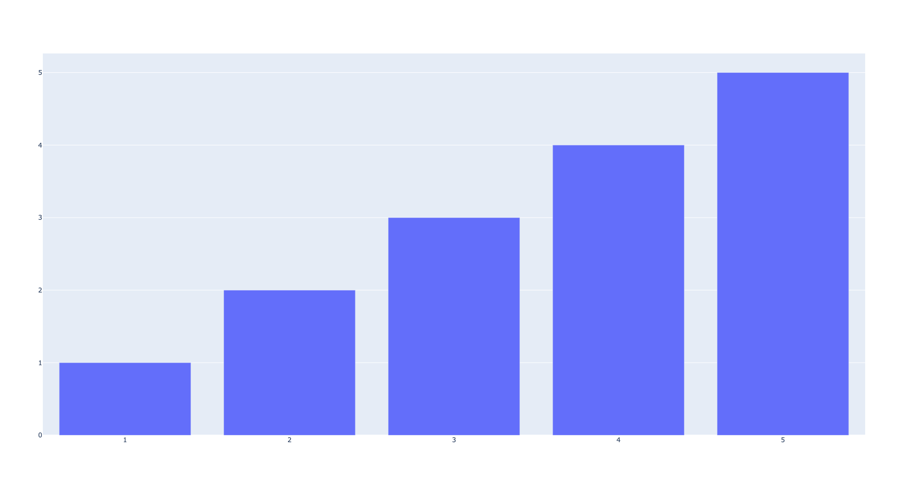
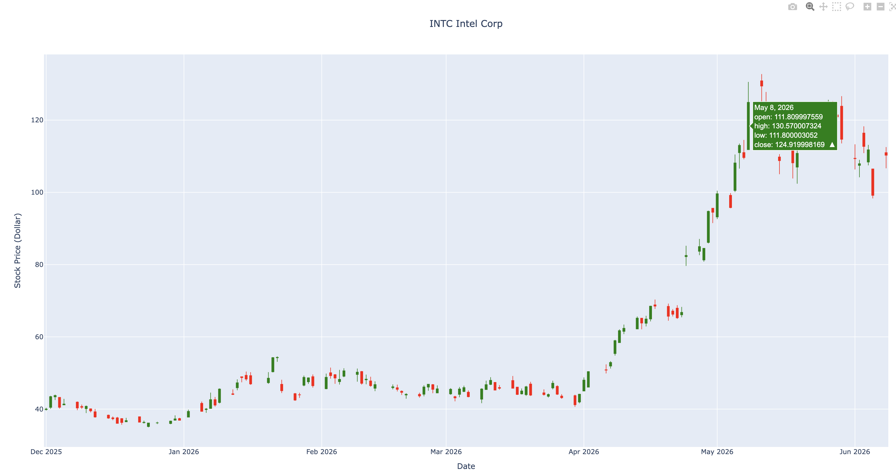

# Plotly

So far, we have mainly used `matplotlib` and `mplfinance` to plot stock charts.

In this section, we will learn a more interactive way to show stock charts and technical indicators.

We will use **Plotly**.

Plotly is a Python library that can create interactive charts using JavaScript in the background.  
This means that when we open the chart in a browser, we can zoom in, zoom out, move around, and check values by moving the mouse over the chart.

First, let's see a very simple example.

```python
import plotly.graph_objects as go
import plotly.io as pio

x = [1, 2, 3, 4, 5]
y = [10, 20, 30, 40, 50]

data = go.Bar(x=x, y=y)

fig = go.Figure(data)
fig.show()
```

Here is the result.



This figure is saved as a PNG file.

However, when you run the Python code, the chart opens in a browser as an interactive graph.  
This means you can zoom in, zoom out, and move your mouse over the bars to see the values.

## Making Candlestick Charts Using Plotly

Next, we will make a candlestick chart using Plotly.

To make a candlestick chart, we use the `Candlestick()` function from `plotly.graph_objects`.

A candlestick chart needs four important stock prices:

| Price | Meaning |
|---|---|
| Open | The price when the market opens |
| High | The highest price during the day |
| Low | The lowest price during the day |
| Close | The price when the market closes |

In Plotly, we can write the candlestick chart like this:

```python 
import yfinance as yf 
import pandas as pd
import datetime as dt
import numpy as np
import mplfinance as mpf
import matplotlib.pyplot as plt
from matplotlib.lines import Line2D
import talib as ta
import plotly.graph_objects as go
import plotly.io as pio

ticker = "INTC"
name = "Intel Corp" 

intel_df= yf.download("INTC", period="5y")
intel_df.columns = intel_df.columns.get_level_values(0)
intel_df = intel_df[["Open", "High", "Low", "Close", "Volume"]]

plot_df = intel_df["2025-12-01":]

data = [go.Candlestick(x = plot_df.index, open = plot_df["Open"], 
        high = plot_df["High"], low = plot_df["Low"], close=plot_df["Close"],
        increasing_line_color = "green",
        increasing_line_width = 1.0,
        increasing_fillcolor = "green",
        decreasing_line_color = "red",
        decreasing_line_width = 1.0,
        decreasing_fillcolor = "red")
        ]

layout = {"title" : {"text":"{} {}".format(ticker, name), "x": 0.5},
          "xaxis": {"title": "Date", "rangeslider": {"visible": False} },
          "yaxis": {"title": "Stock Price (Dollar)", "side":"left", "tickformat":","},
          "plot_bgcolor":"light blue"
}

fig = go.Figure(data=data, layout=go.Layout(layout))

fig.show()
```

The result looks like this:



Here, I took a screenshot of the HTML output to show the interactivity of Plotly.